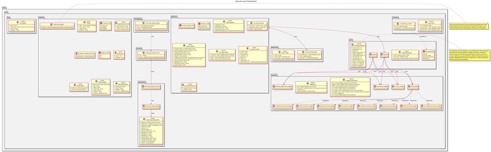

:PROPERTIES:
:ID: 9A71F1F5-C3ED-4C07-9D7D-C5B42D4A1332
:END:
#+title: ores.ore.core
#+name: ore.core
#+full_name: ores.ore.core
#+description: The ORE document engine — XSD-generated XML bindings, instrument mappers, the importer, exporter and round trip, the market data readers, and the import planner and scanner.
#+type: ores.codegen.component
#+level: cross
#+filetags: :ore:core:component:
#+created: 2026-05-19
#+updated: 2026-09-26
#+brief: ORE document engine

* Diagram

#+attr_html: :width 100% :alt ores.ore.core component diagram
#+caption: ores.ore.core

* Summary

=ores.ore.core= is the engine that moves ORE documents in and out of the
ORES domain model. It holds the =xsdcpp=-generated bindings for ORE's whole
XML vocabulary, twelve hand-written mappers between those bindings and the
=ores.trading= and =ores.refdata= domain types, the importer, the exporter
and the directory round trip, readers for ORE's market data text formats,
the import planner and directory scanner, and the generated series key
shape entity stack.

The XSD bindings are the largest part of the component by far and are
produced by a generator outside the build. See
[[id:2DB7C1A3-3191-4D6E-8355-B8BE30BB7809][xsdcpp]] before regenerating them.

* Inputs

- ORE XML documents read from disk: portfolios, currency configurations,
  calendar adjustments and conventions.
- ORE market data text files (=-market*.txt=, =fixings*.txt=) and the
  =oresmd= series keys they carry.
- The series key shape reference rows, from which the key registry is
  built at construction.
- ORES trading and reference data objects to serialise back to ORE XML.

* Outputs

- Trading domain objects: trades with their instruments and envelopes,
  plus mapped conventions and FX conventions.
- Reference data objects: currencies, calendar adjustments, portfolios
  and books.
- Regenerated ORE XML documents, mirrored by the round trip.
- The series key shape entity, through the generated repository and
  service facets.

* Entry points

- =include/ores.ore.core/domain/= — the =xsdcpp= bindings and the mappers.
- =include/ores.ore.core/xml/= — the importer, the exporter and the round trip.
- =include/ores.ore.core/market/= — the ORE market data readers, the series
  key registry and the FX quote convention checker.
- =include/ores.ore.core/scanner/= — the directory walk that classifies ORE
  files by root element.
- =include/ores.ore.core/planner/= — the import plan and its choices.
- =include/ores.ore.core/hierarchy/= — the portfolio and book node builder.
- =include/ores.ore.core/repository/=, =service/=, =messaging/= and
  =presentation/= — the generated series key shape stack.
- =include/ores.ore.core/log/= — the ORE engine log line parser.

* Dependencies

- =ores.ore.api= — the shared contract, linked publicly.
- =ores.database= — the database context, linked publicly.
- =ores.refdata.api= and =ores.trading.api= — the domain types the mappers
  target, linked publicly.
- =ores.dq.api=, =ores.history.core=, =ores.logging=, =ores.platform=,
  =ores.utility= and Boost — linked privately.

XML parsing is the generated binding code, not a library: the component
links neither =pugixml= nor =nats.c=.

* See also

- [[id:0F93B352-F234-4D9D-82E6-05218BE645E8][ores.ore.api]] — the shared contract and the entity protocol.
- [[id:EF8FD20D-0B9C-4379-8BBD-B4FCF2F5F0C7][ores.ore.service]] — the runnable host.
- [[id:5F280C8C-8C50-40A2-8C84-C85B8821D33E][ores.ore]] — the composite this part belongs to.
- [[id:F9AE7F54-D995-476A-BA24-93698BF5029D][ORE market data catalogue]] — the market data files this part reads.
- [[id:DF2B616F-E112-4C57-A73B-69F85BE96EF4][Market data architecture]] — where the readers sit in the wider flow.
- [[id:A3B7C9E1-4F2D-8A6B-5E1C-9D3F7A0B2E4C][ORE model configuration]] — the configuration files this part parses.
- [[id:7302A9A4-8B64-4C92-8582-49FB5A2219A2][How do I round trip an ORE document through the database?]] — the live path for the same documents.
- [[id:1CBDEA40-5FAE-4F04-BD21-2BB29172B5AA][Open Source Risk Engine (ORE)]] — the upstream engine.
