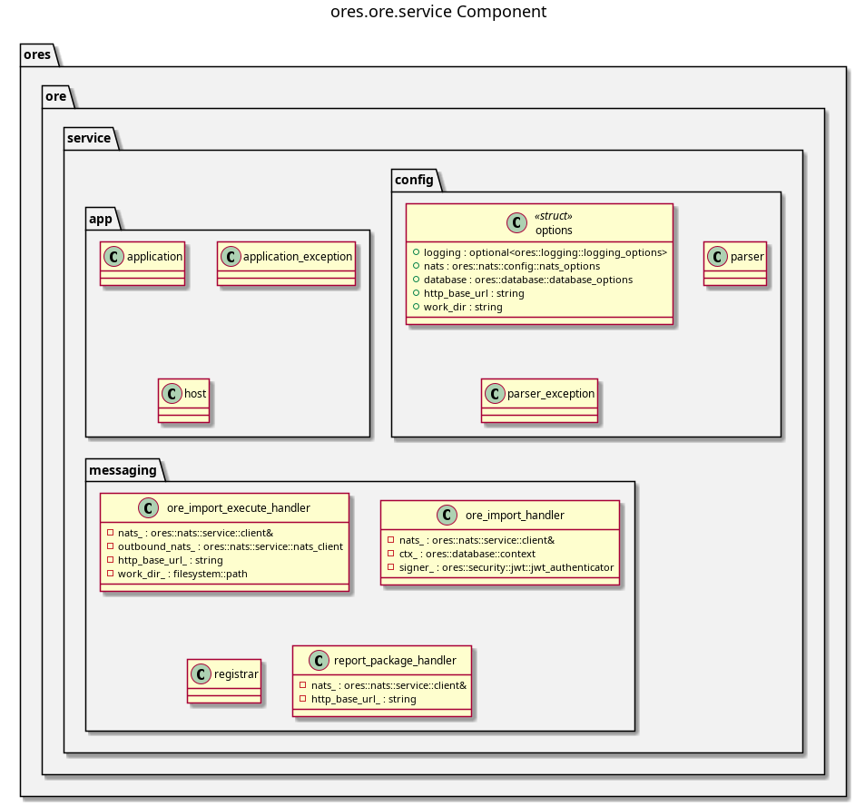

:PROPERTIES:
:ID: EF8FD20D-0B9C-4379-8BBD-B4FCF2F5F0C7
:END:
#+title: ores.ore.service
#+description: NATS service entrypoint for the ORE integration domain.
#+type: ores.codegen.component
#+level: cross
#+filetags: :ore:service:component:
#+created: 2026-05-19
#+updated: 2026-05-19
#+name: ore.service
#+full_name: ores.ore.service
#+brief: ORE import microservice

* Diagram

#+attr_html: :width 100% :alt ores.ore.service component diagram
#+caption: ores.ore.service

* Summary

=ores.ore.service= is the NATS service entrypoint for the ORE integration
domain. It reads configuration, opens NATS connections, registers all message
handlers from =ores.ore.core=, and runs the event loop.

* Inputs

- Configuration file: NATS server URL and environment settings.
- NATS request messages for ORE XML operations.

* Outputs

- A running NATS service for ORE operations.
- NATS response messages returned to callers.

* Entry points

- =src/main.cpp=, =src/app/=, =src/config/=.

* Dependencies

- =ores.ore.core=, =ores.ore.api=, =ores.logging=, =nats.c=.

* See also

- [[id:9A71F1F5-C3ED-4C07-9D7D-C5B42D4A1332][ores.ore.core]] — all ORE integration logic.
