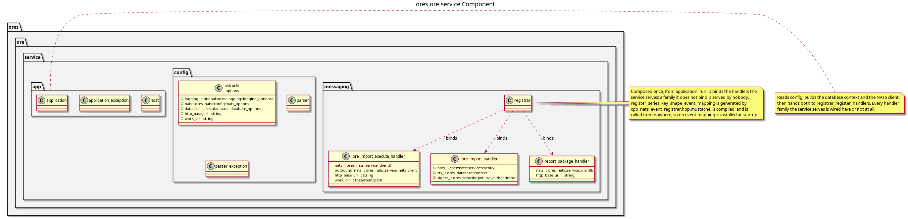

:PROPERTIES:
:ID: EF8FD20D-0B9C-4379-8BBD-B4FCF2F5F0C7
:END:
#+title: ores.ore.service
#+description: The runnable host for the ORE integration — configuration, the import worklist, execute and rollback handlers, and the report package handler.
#+type: ores.codegen.component
#+level: cross
#+filetags: :ore:service:component:
#+created: 2026-05-19
#+updated: 2026-09-26
#+name: ore.service
#+full_name: ores.ore.service
#+brief: ORE import service

* Diagram

#+attr_html: :width 100% :alt ores.ore.service component diagram
#+caption: ores.ore.service

* Summary

=ores.ore.service= is the runnable host of the component. It reads its
configuration, opens the NATS and database connections, subscribes the ORE
import subjects, and runs the service loop.

The import handlers are the part's substance: the worklist handler that
stages an uploaded directory, the execute handler that plans and saves the
documents into the trading and reference data model, the rollback handler,
and the report package handler that assembles an ORE run's inputs.

The generated series key shape handlers are *not* composed here. Nothing
serves that protocol today, and the clean standard requires either a
composition point or a recorded reason; see the clean task.

* Inputs

- Configuration: NATS, database, logging, the HTTP base URL and the work
  directory.
- NATS requests on =workflow.v1.ore.import=, =ore.v1.ore.import.execute=
  and =ore.v1.ore.import.rollback=, and the reporting package preparation.
- The uploaded import tarball, fetched from object storage into the work
  directory.

* Outputs

- Imported and rolled-back rows in the trading and reference data model.
- NATS responses carrying the import plan, the per-item outcome and any
  errors.
- A running service process.

* Entry points

- =src/main.cpp= — process entry point.
- =src/app/= — the application and its host.
- =src/config/= — the command line and environment parser.
- =src/messaging/= — the registrar and the import, execute, rollback and
  report package handlers.

* Dependencies

- =ores.service=, =ores.nats=, =ores.database=, =ores.utility=,
  =ores.telemetry.core= and =ores.eventing.core= — linked publicly.
- =ores.ore.core=, =ores.ore.api=, =ores.storage=, =ores.workflow.api=,
  =ores.iam.client=, =ores.refdata.api=, =ores.trading.api=,
  =ores.reporting.api= and Boost — linked privately.

* See also

- [[id:9A71F1F5-C3ED-4C07-9D7D-C5B42D4A1332][ores.ore.core]] — the engine the handlers drive.
- [[id:0F93B352-F234-4D9D-82E6-05218BE645E8][ores.ore.api]] — the protocol this part serves.
- [[id:5F280C8C-8C50-40A2-8C84-C85B8821D33E][ores.ore]] — the composite this part belongs to.
- [[id:7302A9A4-8B64-4C92-8582-49FB5A2219A2][How do I round trip an ORE document through the database?]] — the workflow an operator drives through this service.
