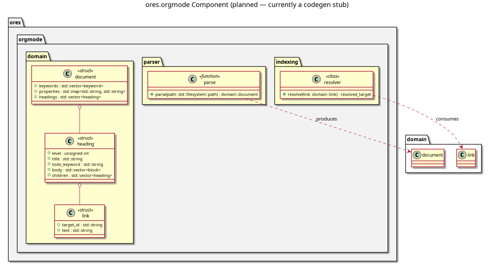

:PROPERTIES:
:ID: 647EA42E-3E11-4898-97BA-8DD2B9949897
:END:
#+title: ores.orgmode
#+description: Pure C++ library parsing org-mode agile/knowledge docs into a document structure and resolving id: links via the org-roam SQLite index.
#+type: ores.codegen.component
#+level: cross
#+filetags: 
#+created: 2026-07-06
#+updated: 2026-07-06
#+name: orgmode
#+full_name: ores.orgmode
#+brief: C++ org-mode parsing and link resolution

* Diagram

#+attr_html: :width 100% :alt ores.orgmode component diagram
#+caption: ores.orgmode

* Summary

=ores.orgmode= parses the subset of org-mode syntax this project's
agile and knowledge docs actually use — frontmatter =#+= keywords, the
=:PROPERTIES:= drawer, headings, paragraphs, lists, tables, and
=[[id:UUID][text]]= links — into a C++ document structure. It also
resolves those =id:= links against the existing org-roam SQLite index
(the same database =compass search=/=compass show= read from), so a
caller can walk from a task to its parent story, a story to its
sprint, etc. Pure C++, no Qt/database/NATS dependency: usable directly
from =ores.shell= and from any future consumer (e.g. the Qt QA
Validation Runner planned in a later story). Entity model is ported
and adapted from an earlier project, =dogen.org=, rather than designed
from scratch.

* Inputs

- A path to a =.org= file on disk (any doc under =doc/= or a component's
  =modeling/= directory).
- The org-roam SQLite index (=org-roam.db=, built and maintained by
  =compass index=) for link resolution.

* Outputs

- A parsed document structure: frontmatter keywords (including
  =#+type:=), the =:ID:= property, a tree of headings with their body
  content (paragraphs/lists/tables), and the document's outgoing
  =id:= links.
- For each =id:= link, the resolved target's path/title/type (or an
  explicit "unresolved" result for a dangling link).

* Entry points

- Parse: read a =.org= file path, return the document structure.
- Resolve: given a document (or a single link), query the org-roam
  index and return the resolved target.

* Dependencies

- None beyond the standard library and this project's usual JSON/
  reflection glue (=ores.platform=) for the corpus-wide JSON-dump test.
  Reads (does not write) the org-roam SQLite index directly — no NATS,
  no =ores.database=, no Qt.

* See also

- [[id:A85B16E3-5A42-4484-A570-13EE7CFA9F50][ores.orgmode: C++ org-mode parsing and org-roam link resolution]] — the driving story.
- [[id:F27E5DF7-6223-4B6F-80A5-CEFBEB1BC756][Component architecture]] — simple vs. composite component layout.
