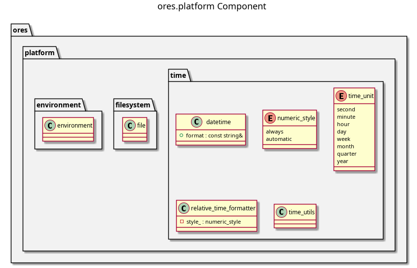

:PROPERTIES:
:ID: 7F3A2E81-B5C9-4D6A-8E12-9C4B3F5A7D0E
:END:
#+title: ores.platform
#+name: platform
#+full_name: ores.platform
#+description: Cross-platform OS abstractions for environment variables, filesystem paths, and network/hardware identity.
#+type: ores.codegen.component
#+level: cross
#+filetags: :platform:os:component:
#+created: 2026-05-20
#+updated: 2026-05-20

* Diagram

#+attr_html: :width 100% :alt ores.platform component diagram
#+caption: ores.platform

* Summary

=ores.platform= provides cross-platform OS abstractions used throughout ORE
Studio. It isolates platform-specific code for environment variables, filesystem
operations, network and hardware identity (hostname, MAC address, stable machine
ID), process information, and time conversions. It depends only on
=ores.utility=, making it a foundation-layer component that all services and
libraries can use without risk of circular dependencies.

* Inputs

- Operating system environment variables.
- Filesystem paths for file read/write/search operations.
- System network interfaces for hardware identity derivation.

* Outputs

- Type-converted environment variable values.
- File contents, directory listings, recursive file searches.
- Hostname, primary MAC address, stable hex-encoded machine ID, process ID.
- Cross-platform =time_t= to UTC/local =tm= conversions.

* Entry points

- =include/ores.platform/environment/= — =environment= variable access.
- =include/ores.platform/filesystem/= — file I/O and directory utilities.
- =include/ores.platform/net/= — =network_info= (hostname, MAC, machine ID).
- =include/ores.platform/process/= — process ID utilities.
- =include/ores.platform/time/= — cross-platform time conversions.

* Dependencies

- =ores.utility= — foundation types and helpers.

* See also

-
