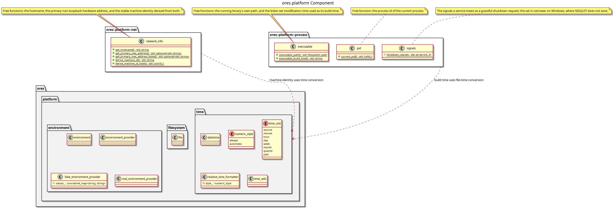

:PROPERTIES:
:ID: 7F3A2E81-B5C9-4D6A-8E12-9C4B3F5A7D0E
:END:
#+title: ores.platform
#+name: platform
#+full_name: ores.platform
#+description: Cross-platform OS abstractions: environment variables, filesystem access, network and hardware identity, process identity and signals, and time conversions.
#+type: ores.codegen.component
#+level: cross
#+filetags: :platform:os:component:
#+created: 2026-05-20
#+updated: 2026-09-25

* Diagram

#+attr_html: :width 100% :alt ores.platform component diagram
#+caption: ores.platform

* Summary

=ores.platform= is the single home for platform-specific code in ORE
Studio. It wraps the operating-system facilities that every other
component would otherwise reach for directly, so that no other component
carries a =_WIN32=, =__linux__= or =__APPLE__= conditional, and no other
component includes a raw OS header. A component that needs a platform
concern calls this component; when the concern has no home here yet, the
abstraction is added here first and only then used.

The component holds no ORE Studio dependency. Its dependencies are the
C++ standard library and Boost: =Boost::process= supplies the current
process id, and =Boost::exception= supplies the exception hierarchy the
filesystem facet throws. That independence is what makes it usable from
every layer, from the foundation libraries up to the services and the
shell, without a risk of a dependency cycle.

The component is model-free. It owns no entity, no NATS subject and no
protocol header, so none of its types is generated and none appears on
the wire. Everything it exposes is hand-written.

The time facet is the busiest surface by a wide margin:
=ores.platform/time/datetime.hpp= is included by several hundred files
across the tree, which is why its format policy matters beyond this
component. Timestamps are stored and transmitted as UTC, in ISO 8601
with a =Z= suffix; local time is used for display only.

* Facets

- =environment/= — process environment variables, read through an
  injectable =environment_provider= so that a caller can substitute an
  in-memory map for the real environment under test. The facet ships
  =fake_environment_provider= for that purpose, and =environment=
  routes every call through the installed provider.
- =filesystem/= — reading and writing file content, deleting a list of
  files, and the =file_not_found= and =io_error= exceptions the facet
  raises.
- =net/= — machine identity: the hostname, the primary non-loopback
  hardware address in both colon-separated and raw-byte form, and the
  stable machine identifier derived from the two.
- =process/= — the current process id, the path and build time of the
  running binary, and the signal set a service treats as a request for
  a graceful shutdown.
- =time/= — the time conversion and formatting surface. =datetime=
  owns the ISO 8601 and database string formats, =time_utils= owns the
  cross-platform =gmtime=, =localtime= and =timegm= wrappers plus the
  calendar-date conversions, and =relative_time_formatter= renders
  human-readable relative times such as "yesterday" and "in 3 days".

* Inputs

- Operating-system environment variables.
- Filesystem paths for file read and write operations.
- System network interfaces, for the hardware identity.
- The executable's own filesystem metadata, for its build time.
- =time_t= and =std::chrono= time points supplied by callers.

* Outputs

- Type-converted environment variable values, with the absent and the
  unparseable case both distinguishable from a real value.
- File content, and the exceptions raised when a file or directory
  cannot be read.
- The hostname, the primary MAC address, a stable hex machine
  identifier, and the current process id.
- Cross-platform =time_t= to UTC and local =tm= conversions, ISO 8601
  and database timestamp strings, calendar dates, and relative-time
  display strings.
- The running binary's path and build time.

* Entry points

- =include/ores.platform/environment/= — =environment=,
  =environment_provider=, =fake_environment_provider=,
  =real_environment_provider=.
- =include/ores.platform/filesystem/= — =file=, =file_not_found=,
  =io_error=.
- =include/ores.platform/net/= — =get_hostname=,
  =get_primary_mac_address=, =get_primary_mac_address_bytes=,
  =derive_machine_id=, =derive_machine_id_hash=.
- =include/ores.platform/process/= — =current_pid=,
  =executable_path=, =executable_build_time=, =shutdown_signals=.
- =include/ores.platform/time/= — =datetime=, =time_utils=,
  =relative_time_formatter=, =k_timestamp_format=.

* Dependencies

- The C++ standard library.
- =Boost::process= — the current process id.
- =Boost::exception= — the exception hierarchy the filesystem facet
  throws.

No ORE Studio component is a dependency of this one.

* See also

- [[id:45CAC01F-BC56-4600-B206-EEE7545AE3AB][Component Architecture Audit]] -- the structural checklist and the platform-placement rule this component exists to satisfy.
- [[id:7B477025-132E-4B20-80B4-D8C9420880B8][Component Clean Standard]] -- the checklist this component was worked through.
- [[id:4AAD3581-CFA7-4B44-A2DD-0236784E939F][Time and Timestamps: Architecture and Conventions]] -- the UTC-storage and local-display policy the =time= facet implements.
- [[id:B079DA67-8408-4BD0-A93C-D108AC780872][Facet]] -- the catalogue that fixes the facet folder names above.
- [[id:B9D3D469-9E59-465F-8C18-34546B680D13][Component Documentation Guide]] -- what fills this overview well.
- [[id:271F40DA-D0EA-4D08-A4F8-3D2B835DF5E7][PlantUML class diagram conventions]] -- the rules the component diagram follows.
- [[id:FB797194-EB03-4837-B12D-E651DD5F16F2][Unit test conventions]] -- the Catch2 conventions the component's tests follow.
- [[id:0FB2EA84-EBB8-45C8-A8C8-F5815431C2D2][Code Review Checklist]] -- the naming and component-only checks this component passes.
