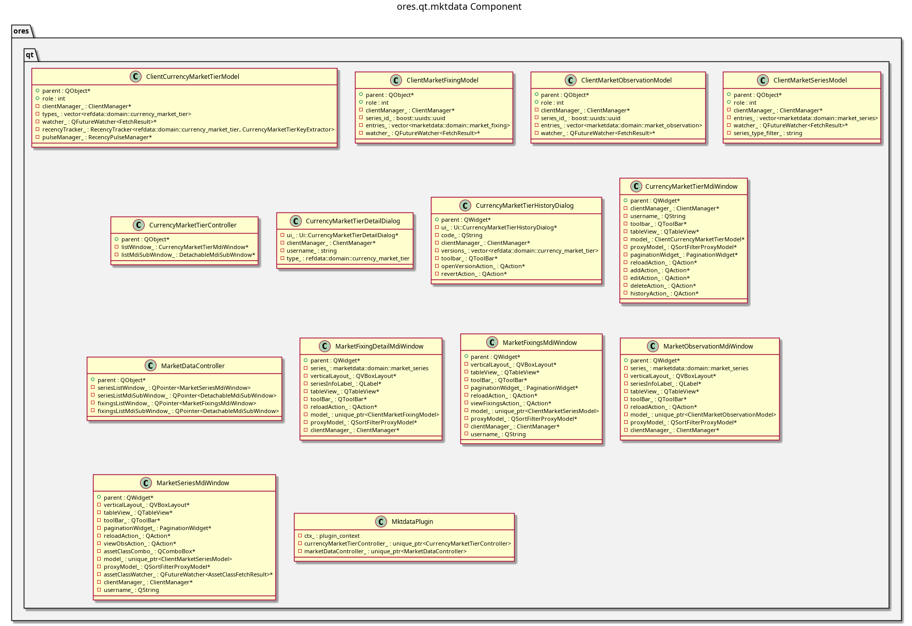

:PROPERTIES:
:ID: 2e83f9b5-67f4-4a1f-95bc-fe1e7ab7d4c0
:END:
#+title: ores.qt.mktdata
#+description: Qt plugin for market data UI — market series, fixings, observations, and currency market tiers.
#+type: component
#+version: 2
#+level: cross
#+filetags: :qt:marketdata:ui:component:
#+created: 2026-05-20
#+updated: 2026-05-20

* Diagram

#+attr_html: :width 100% :alt ores.qt.mktdata component diagram
#+caption: ores.qt.mktdata

* Summary

=ores.qt.mktdata= is the Qt plugin for the market data domain. It provides
MDI windows and dialogs for browsing and managing market series, market
fixings, market observations, and currency market tiers. Market data is
read-heavy; the plugin surfaces time-series data for curves and fixings
consumed by the analytics and compute layers.

* Inputs

- NATS responses from the market data service (market series, fixings,
  observations, currency market tiers).
- User interactions: browse/view market series and fixing history.

* Outputs

- Rendered MDI windows for market data entities.
- NATS request messages sent to the market data service on user actions.

* Entry points

- =include/ores.qt/MktdataPlugin.hpp= — plugin class.
- =include/ores.qt/MarketDataController.hpp= — market data entity controller.
- =include/ores.qt/CurrencyMarketTierController.hpp= — currency tier controller.

* Dependencies

- =ores.qt.api= — IPlugin, base controller/window/dialog classes, ClientManager.
- =ores.marketdata.api= — market series, fixing, observation domain types and NATS schemas.
- =ores.refdata.api= — reference data types (currencies) used in market series.
- =ores.dq.api= — data quality types used in market data validation.
- =ores.storage= — storage abstraction for market data persistence.

* See also

- [[id:6a62d943-fac9-4b77-9e22-f265557dcf1a][ores.marketdata.api]] — domain types and NATS protocol schemas for market data.
- [[id:654be6cd-d212-4ee5-a7b4-8af125787522][ores.refdata.api]] — reference data types (currencies) consumed by market data.
- [[id:ffcfc860-204d-4f48-ae34-d3e382d7a02b][ores.dq.api]] — data quality domain types.
- [[id:30a3a7f4-e1a9-42fb-af9d-ff36fa0f3d21][ores.qt.api]] — shared Qt infrastructure and base classes.
- [[id:e81c7fea-33e4-400a-839a-9d1618bed211][Qt Plugin Architecture]] — plugin lifecycle and menu sequence.
- [[id:fc186d19-9421-45a2-bbcc-4355d66aa41f][Entity Controller Pattern]] — controller/window/dialog/model structure.
