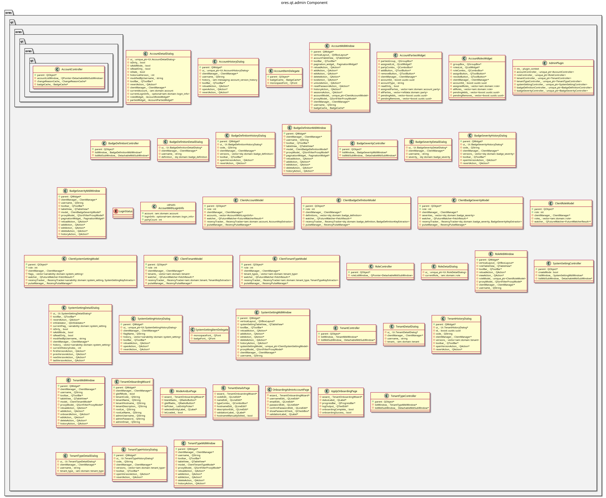

:PROPERTIES:
:ID: DB5A4924-8F0A-440C-873E-D823F430043E
:END:
#+title: ores.qt.admin
#+name: qt.admin
#+full_name: ores.qt.admin
#+description: Qt plugin for IAM UI — accounts, roles, tenants, system settings, badge types, and tenant onboarding.
#+type: ores.codegen.component
#+level: cross
#+filetags: :qt:iam:ui:component:
#+created: 2026-05-20
#+updated: 2026-05-20

* Diagram

#+attr_html: :width 100% :alt ores.qt.admin component diagram
#+caption: ores.qt.admin

* Summary

=ores.qt.admin= is the Qt plugin for identity and access management UI.
It provides MDI windows and dialogs for managing accounts, roles, tenants,
tenant types, system settings, badge definitions, and badge severities.
It also provides the Tenant Onboarding Wizard for provisioning new tenants
and contributes the Configuration and Administration submenus to the System
menu. Variability (feature flags) are surfaced through the system-settings
controllers.

* Inputs

- NATS responses from the IAM service (accounts, roles, tenants, tenant types,
  system settings, badge definitions, badge severities).
- NATS responses from the controller service (variability/system settings).
- User interactions: create/edit/delete/view-history on IAM entities.

* Outputs

- Rendered MDI windows for each IAM entity type.
- NATS request messages sent to the IAM and controller services on user actions.
- Configuration and Administration submenus injected into the System menu.

* Entry points

- =include/ores.qt/AdminPlugin.hpp= — plugin class; contributes to System menu.
- =include/ores.qt/AccountController.hpp= — account entity controller.
- =include/ores.qt/TenantController.hpp= — tenant entity controller.
- =include/ores.qt/TenantOnboardingWizard.hpp= — multi-step tenant provisioning.

* Dependencies

- =ores.qt.api= — IPlugin, base controller/window/dialog classes, ClientManager.
- =ores.iam.api= — account, role, tenant, badge domain types and NATS schemas.
- =ores.controller.api= — system-setting and variability domain types.
- =ores.variability.api= — variability/feature-flag domain types.

* See also

- [[id:4E0DC581-D74D-4BD1-87D2-7F524A36D20C][ores.iam.api]] — domain types and NATS protocol schemas for IAM.
- [[id:D00BEA0D-E501-C534-A013-E6F40C1A6097][ores.iam.core]] — server-side IAM logic and NATS handlers.
- [[id:85D20E29-0EBD-41FF-9F32-10F60AF074A8][ores.controller.api]] — system-setting domain types.
- [[id:26218AD6-C63E-44E8-9B92-7FB51C366566][ores.variability.api]] — variability/feature-flag domain types.
- [[id:30A3A7F4-E1A9-42FB-AF9D-FF36FA0F3D21][ores.qt.api]] — shared Qt infrastructure and base classes.
- [[id:E81C7FEA-33E4-400A-839A-9D1618BED211][Qt Plugin Architecture]] — plugin lifecycle and menu-contribution model.
- [[id:FC186D19-9421-45A2-BBCC-4355D66AA41F][Entity Controller Pattern]] — controller/window/dialog/model structure.
