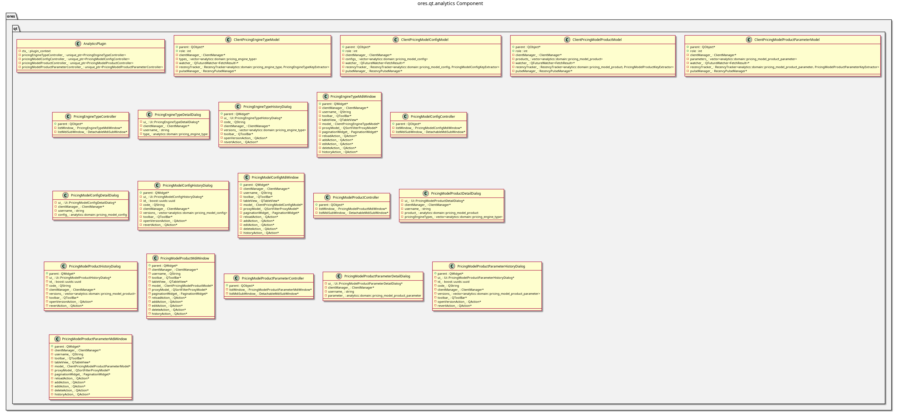

:PROPERTIES:
:ID: 970667D1-8BA8-4B49-B047-0D6D4C4CE498
:END:
#+title: ores.qt.analytics
#+name: qt.analytics
#+full_name: ores.qt.analytics
#+description: Qt plugin for analytics pricing UI — model configurations, products, parameters, and pricing engine types.
#+type: ores.codegen.component
#+level: cross
#+filetags: :qt:analytics:ui:component:
#+created: 2026-05-20
#+updated: 2026-05-20

* Diagram

#+attr_html: :width 100% :alt ores.qt.analytics component diagram
#+caption: ores.qt.analytics

* Summary

=ores.qt.analytics= is the Qt plugin for the analytics pricing domain.
It provides MDI windows and dialogs for managing pricing model configurations,
pricing model products, pricing model product parameters, and pricing engine
types. It owns the Analytics top-level menu and the Analytics Codes submenu;
=ores.qt.compute= contributes additional reporting code types to that submenu
during the =setup_menus= phase.

* Inputs

- NATS responses from the analytics service (model configs, products,
  parameters, engine types).
- User interactions: create/edit/delete/view-history on analytics entities.
- =shared_menus_context.analytics_menu= and =analytics_codes_menu= pointers
  received in =setup_menus=.

* Outputs

- Rendered MDI windows for pricing model entities.
- NATS request messages sent to the analytics service on user actions.
- Analytics and Analytics Codes menus (returned via =create_menus=, with
  items contributed by ComputePlugin already appended).

* Entry points

- =include/ores.qt/AnalyticsPlugin.hpp= — plugin class; owns the Analytics menu.
- =include/ores.qt/PricingModelConfigController.hpp= — model config controller.
- =include/ores.qt/PricingEngineTypeController.hpp= — engine type controller.

* Dependencies

- =ores.qt.api= — IPlugin, base controller/window/dialog classes, ClientManager.
- =ores.analytics.api= — pricing model and engine type domain types and NATS schemas.
- =ores.refdata.api= — reference data types used in pricing configuration.

* See also

- [[id:66D3F1D6-1926-40CF-BCF5-AA42F14AD6D5][ores.analytics.api]] — domain types and NATS protocol schemas for analytics.
- [[id:654BE6CD-D212-4EE5-A7B4-8AF125787522][ores.refdata.api]] — reference data types used in model configuration.
- [[id:03EAE018-5E61-4005-AC9A-EFF827A46178][ores.qt.compute]] — contributes report types and concurrency policies to the Analytics Codes submenu.
- [[id:30A3A7F4-E1A9-42FB-AF9D-FF36FA0F3D21][ores.qt.api]] — shared Qt infrastructure and base classes.
- [[id:E81C7FEA-33E4-400A-839A-9D1618BED211][Qt Plugin Architecture]] — plugin lifecycle and the two-phase menu sequence.
- [[id:FC186D19-9421-45A2-BBCC-4355D66AA41F][Entity Controller Pattern]] — controller/window/dialog/model structure.
