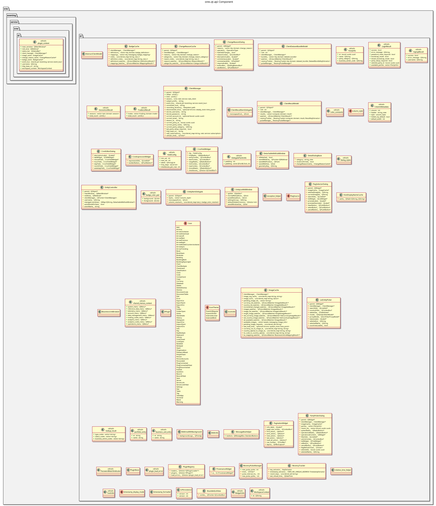

:PROPERTIES:
:ID: 30A3A7F4-E1A9-42FB-AF9D-FF36FA0F3D21
:END:
#+title: ores.qt.api
#+name: qt.api
#+full_name: ores.qt.api
#+description: Shared Qt infrastructure — IPlugin interface, base controllers/windows/dialogs, ClientManager, caches, and entity UI patterns.
#+type: ores.codegen.component
#+level: cross
#+filetags: :qt:ui:api:component:
#+created: 2026-05-20
#+updated: 2026-05-20

* Diagram

#+attr_html: :width 100% :alt ores.qt.api component diagram
#+caption: ores.qt.api

* Summary

=ores.qt.api= is the shared infrastructure layer for the ORE Studio Qt
application. It defines the =IPlugin= interface and =PluginBase= that all
feature plugins implement, the =plugin_context= and =shared_menus_context=
structs passed through the plugin lifecycle, and the base classes for the
entity UI pattern: =EntityController=, =EntityListMdiWindow=,
=DetailDialogBase=, and =AbstractClientModel=. It also provides
=ClientManager= (the NATS client wrapper), shared caches (badge, image,
change-reason), MDI utilities, icon utilities, and common dialog helpers
used across all plugins.

* Inputs

- NATS client connection provided by =ores.nats= and =ores.eventing=.
- Domain type definitions from all linked =ores.*.api= libraries.
- Qt plugin loader infrastructure (=QPluginLoader=) for the plugin protocol.

* Outputs

- =IPlugin= / =PluginBase= — the interface every Qt plugin implements.
- =plugin_context= / =shared_menus_context= — lifecycle context structs.
- =EntityController=, =EntityListMdiWindow=, =DetailDialogBase=,
  =AbstractClientModel= — base classes for the entity UI pattern.
- =ClientManager= — typed NATS request/response wrapper for all domain calls.
- =BadgeCache=, =ChangeReasonCache=, =ImageCache= — session-scoped caches.
- Utility headers: =IconUtils=, =MdiUtils=, =TextUtils=, etc. (=FontUtils=
  moved to [[id:A030D485-31ED-4383-859F-F80A1D6FDB05][ores.qt.headless]].)

* Entry points

- =include/ores.qt/IPlugin.hpp= — plugin interface with lifecycle methods.
- =include/ores.qt/PluginBase.hpp= — QObject-based IPlugin implementation base.
- =include/ores.qt/plugin_context.hpp= — login context passed to =on_login=.
- =include/ores.qt/EntityController.hpp= — base controller class.
- =include/ores.qt/ClientManager.hpp= — NATS client wrapper.

* Dependencies

- =ores.nats= — NATS transport client.
- =ores.eventing= — eventing infrastructure for change notifications.
- =ores.iam.api= — IAM domain types (session, account).
- =ores.refdata.api= — refdata domain types used in shared pickers.
- =ores.trading.api= — trading domain types used in shared pickers.
- =ores.compute.api=, =ores.scheduler.api=, =ores.dq.api=, =ores.http.api=,
  =ores.assets.api= — domain types for shared UI helpers.
- =ores.logging=, =ores.utility=, =ores.platform= — infrastructure.

* See also

- [[id:25812E6F-7AD1-36E4-697B-EEC8015C4F1F][ores.qt]] — the application shell (MainWindow) that loads and drives plugins.
- [[id:E81C7FEA-33E4-400A-839A-9D1618BED211][Qt Plugin Architecture]] — full plugin lifecycle and menu-building sequence.
- [[id:FC186D19-9421-45A2-BBCC-4355D66AA41F][Entity Controller Pattern]] — detailed description of the base class pattern.
- [[id:F7DE2705-4D20-4878-A10C-A834F3283683][Badge system wiring]] — how =BadgeCache= fits into the system and how to add new badges.
- [[id:C9C24C99-F16C-45BE-A262-1C0F4502765E][ores.nats]] — NATS transport underlying ClientManager.
