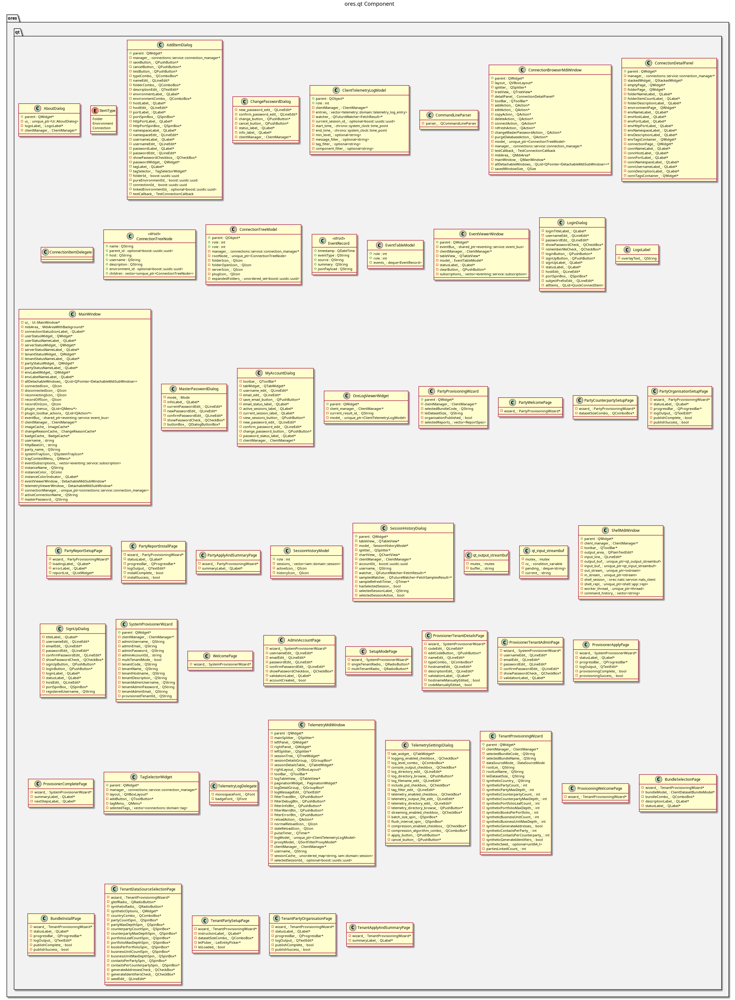

:PROPERTIES:
:ID: 25812E6F-7AD1-36E4-697B-EEC8015C4F1F
:END:
#+title: ores.qt
#+name: qt
#+full_name: ores.qt
#+description: Qt 6 desktop application — MDI interface for managing ORE Studio entities with NATS-backed async data loading.
#+type: ores.codegen.component
#+level: cross
#+filetags: :qt:desktop:ui:component:
#+created: 2026-05-20
#+updated: 2026-05-20

* Diagram

#+attr_html: :width 100% :alt ores.qt component diagram
#+caption: ores.qt

* Summary

=ores.qt= is the Qt 6 desktop application for ORE Studio. It provides a
Multiple Document Interface (MDI) with detachable windows for managing
currencies, accounts, parties, trades, and other domain entities. All data
operations are asynchronous via NATS; the UI uses an entity-controller pattern
where =MainWindow= delegates to domain-specific controllers (e.g.,
=CurrencyController=) which manage their MDI windows, dialogs, and table
models. The application is composed of the core shell and feature modules
housed in sibling projects under =ores.qt.*=.

* Inputs

- NATS responses from domain services (IAM, refdata, trading, etc.).
- User interactions: login credentials, entity create/edit/delete commands.
- Server connection bookmarks from =ores.connections=.

* Outputs

- Rendered MDI desktop with entity management windows.
- NATS request messages sent to domain services on user actions.

* Entry points

- =src/main.cpp= — application entry point.
- =src/MainWindow.cpp= — MDI shell and controller wiring.
- =src/LoginDialog.cpp= — authentication UI.

* Dependencies

- Qt 6 (Widgets, Network) — UI toolkit.
- =ores.qt.api= — shared Qt types, NATS client wrapper, base controllers.
- Domain API libraries: =ores.iam.api=, =ores.refdata.api=, =ores.trading.api=,
  etc. — NATS protocol types.
- =ores.connections= — server bookmark storage.
- =ores.nats= — NATS transport.

* See also

- [[id:30A3A7F4-E1A9-42FB-AF9D-FF36FA0F3D21][ores.qt.api]] — shared infrastructure, IPlugin, and base entity UI classes.
- [[id:E81C7FEA-33E4-400A-839A-9D1618BED211][Qt Plugin Architecture]] — plugin lifecycle and two-phase menu sequence.
- [[id:FC186D19-9421-45A2-BBCC-4355D66AA41F][Entity Controller Pattern]] — how domain controllers, windows, and dialogs are structured.
- [[id:DB5A4924-8F0A-440C-873E-D823F430043E][ores.qt.admin]] — IAM UI plugin.
- [[id:970667D1-8BA8-4B49-B047-0D6D4C4CE498][ores.qt.analytics]] — analytics pricing UI plugin.
- [[id:03EAE018-5E61-4005-AC9A-EFF827A46178][ores.qt.compute]] — compute/reporting UI plugin.
- [[id:92492264-B67A-4AC7-8A58-7D706D9F0DAB][ores.qt.data_management]] — Data Management menu owner.
- [[id:2E83F9B5-67F4-4A1F-95BC-FE1E7AB7D4C0][ores.qt.mktdata]] — market data UI plugin.
- [[id:621194C4-D438-4215-AE40-21FBE8FF0D85][ores.qt.refdata]] — reference data UI plugin.
- [[id:4092E7E6-C663-4E5E-B330-63BFECE7CA51][ores.qt.scheduler]] — job scheduling UI plugin.
- [[id:3FA355D1-38FD-4E35-9E05-2185882B8AC1][ores.qt.trading]] — trading UI plugin.
- [[id:B7269E9C-83B6-4D6C-80DE-D796AB89B1BD][ores.qt.workflow]] — workflow UI plugin.
- [[id:31D9C75A-DE71-4B98-9D33-D8ED86000C94][ores.qt.workspace]] — workspace management UI plugin.
