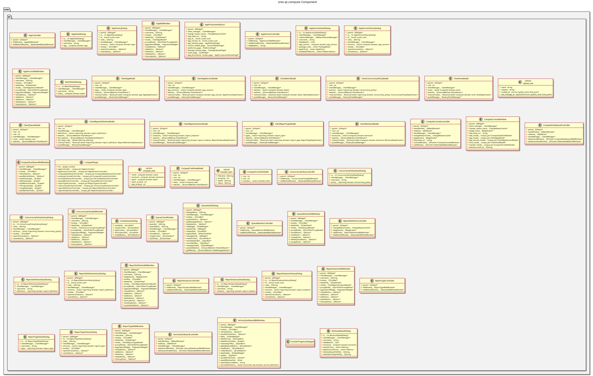

:PROPERTIES:
:ID: 03EAE018-5E61-4005-AC9A-EFF827A46178
:END:
#+title: ores.qt.compute
#+name: qt.compute
#+full_name: ores.qt.compute
#+description: Qt plugin for compute/reporting UI — report definitions, instances, apps, compute dashboard, and concurrency policies.
#+type: ores.codegen.component
#+level: cross
#+filetags: :qt:compute:reporting:ui:component:
#+created: 2026-05-20
#+updated: 2026-05-20

* Diagram

#+attr_html: :width 100% :alt ores.qt.compute component diagram
#+caption: ores.qt.compute

* Summary

=ores.qt.compute= is the Qt plugin for the compute and reporting domain.
It provides MDI windows and dialogs for report definitions, report instances,
apps, app versions, batches, workunits, hosts, and queues, plus a Compute
Dashboard and Compute Console for monitoring running jobs. It contributes
report-related items to the Analytics menu (owned by =ores.qt.analytics=) and
code types (Report Types, Concurrency Policies) to the Analytics Codes submenu.
It also contributes Service Dashboard and Message Queue views to the System menu.

* Inputs

- NATS responses from the compute, reporting, scheduling, workflow, and
  controller services.
- User interactions: submit/cancel reports, launch apps, monitor compute state.
- =shared_menus_context.analytics_menu= and =analytics_codes_menu= for
  contributing items during =setup_menus=.

* Outputs

- Rendered MDI windows for compute and reporting entities.
- NATS request messages to compute, reporting, ore, and controller services.
- Menu items contributed to the shared Analytics and System menus.

* Entry points

- =include/ores.qt/ComputePlugin.hpp= — plugin class; contributes to Analytics menu.
- =include/ores.qt/ComputeDashboardController.hpp= — live compute state overview.
- =include/ores.qt/ComputeConsoleController.hpp= — interactive job console.

* Dependencies

- =ores.qt.api= — IPlugin, base controller/window/dialog classes, ClientManager.
- =ores.compute.api= — compute domain types and NATS schemas.
- =ores.scheduler.api= — scheduling domain types.
- =ores.reporting.api= — report definition/instance domain types and NATS schemas.
- =ores.workflow.core= — workflow execution types used in compute coordination.
- =ores.ore.core= — ORE model types for report payload construction.
- =ores.ore.api= — ORE API types.
- =ores.controller.api= — service dashboard and system monitor types.

* See also

- [[id:A59E121A-B8FB-43F0-A5CD-1FA5F426E66A][ores.compute.api]] — compute domain types and NATS protocol schemas.
- [[id:E5AC5738-0694-494E-823E-0322F4902AD2][ores.reporting.api]] — report domain types and NATS protocol schemas.
- [[id:B49ED6E9-20DC-421F-A0F9-D7EAB6B54F9B][ores.scheduler.api]] — scheduling domain types.
- [[id:0F93B352-F234-4D9D-82E6-05218BE645E8][ores.ore.api]] — ORE model integration types.
- [[id:9A71F1F5-C3ED-4C07-9D7D-C5B42D4A1332][ores.ore.core]] — ORE XML import/export and risk engine integration.
- [[id:970667D1-8BA8-4B49-B047-0D6D4C4CE498][ores.qt.analytics]] — owns the Analytics menu that compute contributes to.
- [[id:30A3A7F4-E1A9-42FB-AF9D-FF36FA0F3D21][ores.qt.api]] — shared Qt infrastructure and base classes.
- [[id:E81C7FEA-33E4-400A-839A-9D1618BED211][Qt Plugin Architecture]] — plugin lifecycle and menu-contribution model.
