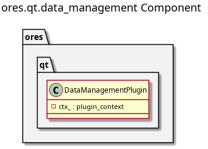

:PROPERTIES:
:ID: 92492264-B67A-4AC7-8A58-7D706D9F0DAB
:END:
#+title: ores.qt.data_management
#+name: qt.data_management
#+full_name: ores.qt.data_management
#+description: Qt plugin owning the Data Management top-level menu and the ores.dq-backed entities' controllers (Data Catalogue, Change Reason, Coding Scheme, Data Librarian).
#+type: ores.codegen.component
#+level: cross
#+filetags: :qt:data_management:ui:component:
#+created: 2026-05-20
#+updated: 2026-07-16

* Diagram

#+attr_html: :width 100% :alt ores.qt.data_management component diagram
#+caption: ores.qt.data_management

* Summary

=ores.qt.data_management= is the Qt plugin that owns the Data Management
top-level menu, and the Qt controllers for every entity owned by
=ores.dq= (=catalog=, =change_reason=, =change_reason_category=,
=code_domain=, =coding_scheme=, =coding_scheme_authority_type=,
=data_domain=, =dataset=, =dataset_bundle=, =methodology=,
=nature_dimension=, =origin_dimension=, =subject_area=,
=treatment_dimension=), plus the Data Librarian window. It pre-creates
the menu handle and passes it via =shared_menus_context= to sibling
plugins during the =setup_menus= phase; =ores.qt.trading= adds Import
ORE Data and =ores.qt.workspace= adds Manage Workspaces to the same
menu.

These entities previously lived in =ores.qt.refdata= despite having no
=ores.refdata= backend at all — moved here to correct that
component-ownership mismatch. None of them has a codegen model yet
(except =code_domain= and =dataset_bundle=, whose models live under
=ores.dq='s own codegen); adding one for the rest is tracked as future
work.

* Inputs

- =shared_menus_context= populated by =MainWindow= with the pre-created
  =data_management_menu= pointer.
- Items contributed to the same menu by sibling plugins (=ores.qt.trading=,
  =ores.qt.workspace=) via =setup_menus=.

* Outputs

- Data Management top-level menu (returned via =create_menus=) for insertion
  into the application menu bar.

* Entry points

- =include/ores.qt/DataManagementPlugin.hpp= — plugin class; menu and
  controller owner.

* Dependencies

- =ores.qt.api= — IPlugin, PluginBase, shared_menus_context.
- =ores.dq.api= — domain types and NATS protocol schemas for the 14
  entities this plugin owns.

* See also

- [[id:AAF28605-81BE-4B7F-9B6E-7B9B1D99D7C3][ores.dq]] — backend for the 14 entities this plugin's controllers wrap.
- [[id:3FA355D1-38FD-4E35-9E05-2185882B8AC1][ores.qt.trading]] — contributes Import ORE Data item.
- [[id:31D9C75A-DE71-4B98-9D33-D8ED86000C94][ores.qt.workspace]] — contributes Manage Workspaces item.
- [[id:30A3A7F4-E1A9-42FB-AF9D-FF36FA0F3D21][ores.qt.api]] — shared Qt infrastructure and base classes.
- [[id:E81C7FEA-33E4-400A-839A-9D1618BED211][Qt Plugin Architecture]] — plugin lifecycle and the two-phase menu sequence.
