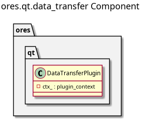

:PROPERTIES:
:ID: 92492264-B67A-4AC7-8A58-7D706D9F0DAB
:END:
#+title: ores.qt.data_transfer
#+name: qt.data_transfer
#+full_name: ores.qt.data_transfer
#+description: Qt plugin that owns the Data Management top-level menu and coordinates item contributions from sibling plugins.
#+type: ores.codegen.component
#+level: cross
#+filetags: :qt:data_management:ui:component:
#+created: 2026-05-20
#+updated: 2026-05-20

* Diagram

#+attr_html: :width 100% :alt ores.qt.data_transfer component diagram
#+caption: ores.qt.data_transfer

* Summary

=ores.qt.data_transfer= is the Qt plugin that owns the Data Management
top-level menu. It pre-creates the menu handle and passes it via
=shared_menus_context= to all other plugins during the =setup_menus= phase.
Sibling plugins contribute their own items: =ores.qt.refdata= adds Data
Catalogue and Data Librarian, =ores.qt.trading= adds Import ORE Data, and
=ores.qt.workspace= adds Manage Workspaces. The plugin has no domain entities
or controllers of its own.

* Inputs

- =shared_menus_context= populated by =MainWindow= with the pre-created
  =data_management_menu= pointer.
- Items contributed to the menu by sibling plugins via =setup_menus=.

* Outputs

- Data Management top-level menu (returned via =create_menus=) for insertion
  into the application menu bar.

* Entry points

- =include/ores.qt/DataTransferPlugin.hpp= — plugin class; menu owner.

* Dependencies

- =ores.qt.api= — IPlugin, PluginBase, shared_menus_context.

* See also

- [[id:621194C4-D438-4215-AE40-21FBE8FF0D85][ores.qt.refdata]] — contributes Data Catalogue and Data Librarian items.
- [[id:3FA355D1-38FD-4E35-9E05-2185882B8AC1][ores.qt.trading]] — contributes Import ORE Data item.
- [[id:31D9C75A-DE71-4B98-9D33-D8ED86000C94][ores.qt.workspace]] — contributes Manage Workspaces item.
- [[id:30A3A7F4-E1A9-42FB-AF9D-FF36FA0F3D21][ores.qt.api]] — shared Qt infrastructure and base classes.
- [[id:E81C7FEA-33E4-400A-839A-9D1618BED211][Qt Plugin Architecture]] — plugin lifecycle and the two-phase menu sequence.
