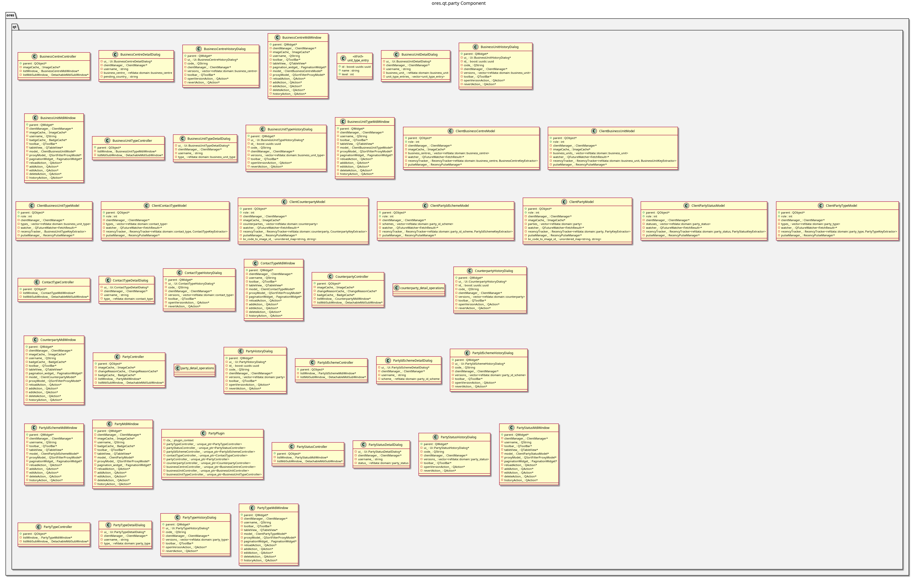

:PROPERTIES:
:ID: 6DE9A7B8-F7BA-4E93-BB93-2FB10C53F9CA
:END:
#+title: ores.qt.party
#+name: qt.party
#+full_name: ores.qt.party
#+description: Qt plugin for party/organisation UI — parties, counterparties, business units, business centres, and organisation codes.
#+type: ores.codegen.component
#+level: cross
#+filetags: :qt:party:organisation:ui:component:
#+created: 2026-05-20
#+updated: 2026-05-20

* Diagram

#+attr_html: :width 100% :alt ores.qt.party component diagram
#+caption: ores.qt.party

* Summary

=ores.qt.party= is the Qt plugin for the party and organisation domain. It
provides MDI windows and dialogs for managing parties, counterparties, business
units, and business centres, and their supporting code types (party types,
party statuses, party ID schemes, contact types, and business unit types). It
contributes its entity actions to the Reference Data menu (owned by
=ores.qt.refdata=) via the =setup_menus= phase.

* Inputs

- NATS responses for party, counterparty, business unit, business centre, and
  organisation code entities.
- User interactions: create/edit/delete/view-history on party entities.
- =shared_menus_context.reference_data_menu= pointer for contributing items.

* Outputs

- Rendered MDI windows for party and organisation entities.
- NATS request messages sent to the relevant party services on user actions.
- Parties, Counterparties, Business Centres, Business Units, and Organisation
  Codes submenu items contributed to the Reference Data menu.

* Entry points

- =include/ores.qt/PartyPlugin.hpp= — plugin class; contributes to Reference Data menu.
- =include/ores.qt/PartyController.hpp= — party entity controller.
- =include/ores.qt/CounterpartyController.hpp= — counterparty entity controller.
- =include/ores.qt/BusinessUnitController.hpp= — business unit controller.

* Dependencies

- =ores.qt.api= — IPlugin, base controller/window/dialog classes, ClientManager.
- =ores.refdata.api= — reference data domain types used in party classification.
- =ores.storage= — storage abstraction for party data persistence.

* See also

- [[id:654BE6CD-D212-4EE5-A7B4-8AF125787522][ores.refdata.api]] — reference data domain types shared with party entities.
- [[id:621194C4-D438-4215-AE40-21FBE8FF0D85][ores.qt.refdata]] — owns the Reference Data menu that party contributes to.
- [[id:30A3A7F4-E1A9-42FB-AF9D-FF36FA0F3D21][ores.qt.api]] — shared Qt infrastructure and base classes.
- [[id:E81C7FEA-33E4-400A-839A-9D1618BED211][Qt Plugin Architecture]] — plugin lifecycle and menu-contribution model.
- [[id:FC186D19-9421-45A2-BBCC-4355D66AA41F][Entity Controller Pattern]] — controller/window/dialog/model structure.
