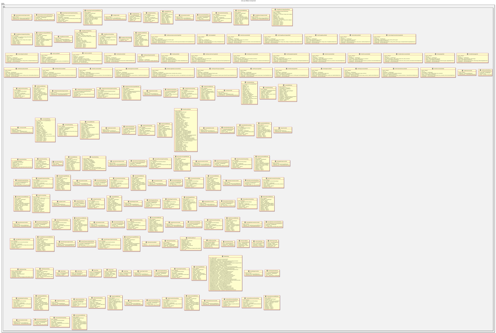

:PROPERTIES:
:ID: 621194C4-D438-4215-AE40-21FBE8FF0D85
:END:
#+title: ores.qt.refdata
#+name: qt.refdata
#+full_name: ores.qt.refdata
#+description: Qt plugin for reference data UI — currencies, countries, trading conventions, coding schemes, datasets, and the data catalogue.
#+type: ores.codegen.component
#+level: cross
#+filetags: :qt:refdata:ui:component:
#+created: 2026-05-20
#+updated: 2026-05-20

* Diagram

#+attr_html: :width 100% :alt ores.qt.refdata component diagram
#+caption: ores.qt.refdata

* Summary

=ores.qt.refdata= is the Qt plugin for the reference data domain. It provides
MDI windows and dialogs for currencies, countries, all trading conventions
(swap, OIS, FRA, ibor, overnight, CDS, FX, deposit, zero), day count
fractions, business day convention types, floating index types, and payment
frequency types. It owns the Reference Data top-level menu; =ores.qt.party=
contributes party-related items to the same menu. The =ores.dq=-backed
Data Catalogue, Change Reason, Coding Scheme, and Data Librarian controllers
previously hosted here despite having no =ores.refdata= backend now live in
=ores.qt.data_management=.

* Inputs

- NATS responses from the refdata and trading services (currencies, countries,
  conventions).
- User interactions: create/edit/delete/view-history on all refdata entities.
- =shared_menus_context.reference_data_menu= pointer for menu ownership.

* Outputs

- Rendered MDI windows for all reference data entities.
- NATS request messages sent to the refdata and trading services on user actions.
- Reference Data top-level menu (returned via =create_menus=).

* Entry points

- =include/ores.qt/RefdataPlugin.hpp= — plugin class; owns Reference Data menu.
- =include/ores.qt/CurrencyController.hpp= — currency entity controller.
- =include/ores.qt/SwapConventionController.hpp= — swap convention controller.

* Dependencies

- =ores.qt.api= — IPlugin, base controller/window/dialog classes, ClientManager.
- =ores.refdata.api= — reference data domain types and NATS schemas.
- =ores.trading.api= — trading convention domain types and NATS schemas.
- =ores.ore.core= — ORE model types used in convention configuration.
- =ores.variability.api= — variability types referenced in some refdata entities.
- =ores.storage= — storage abstraction for refdata persistence.

* See also

- [[id:654BE6CD-D212-4EE5-A7B4-8AF125787522][ores.refdata.api]] — domain types and NATS protocol schemas for reference data.
- [[id:FD34A3B5-0E24-467A-A9D7-A2F2E7480E1B][ores.trading.api]] — trading convention domain types and NATS schemas.
- [[id:9A71F1F5-C3ED-4C07-9D7D-C5B42D4A1332][ores.ore.core]] — ORE model types used in convention configuration.
- [[id:6DE9A7B8-F7BA-4E93-BB93-2FB10C53F9CA][ores.qt.party]] — contributes party items to the Reference Data menu.
- [[id:92492264-B67A-4AC7-8A58-7D706D9F0DAB][ores.qt.data_management]] — owns the Data Catalogue, Change Reason, Coding Scheme, and Data Librarian controllers previously (mistakenly) hosted here.
- [[id:30A3A7F4-E1A9-42FB-AF9D-FF36FA0F3D21][ores.qt.api]] — shared Qt infrastructure and base classes.
- [[id:E81C7FEA-33E4-400A-839A-9D1618BED211][Qt Plugin Architecture]] — plugin lifecycle and menu-contribution model.
- [[id:FC186D19-9421-45A2-BBCC-4355D66AA41F][Entity Controller Pattern]] — controller/window/dialog/model structure.
