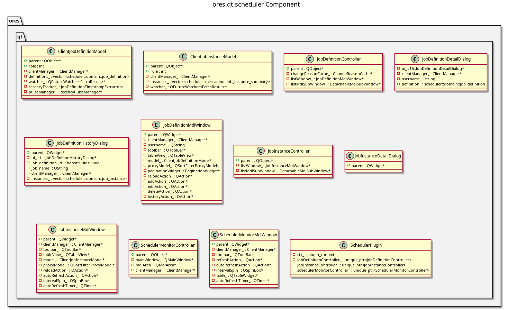

:PROPERTIES:
:ID: 4092E7E6-C663-4E5E-B330-63BFECE7CA51
:END:
#+title: ores.qt.scheduler
#+name: qt.scheduler
#+full_name: ores.qt.scheduler
#+description: Qt plugin for job scheduling UI — job definitions, job instances, and the scheduler monitor.
#+type: ores.codegen.component
#+level: cross
#+filetags: :qt:scheduler:ui:component:
#+created: 2026-05-20
#+updated: 2026-05-20

* Diagram

#+attr_html: :width 100% :alt ores.qt.scheduler component diagram
#+caption: ores.qt.scheduler

* Summary

=ores.qt.scheduler= is the Qt plugin for the job scheduling domain. It
provides MDI windows and dialogs for managing job definitions, viewing and
managing job instances, and the Scheduler Monitor for live job-state
inspection. It owns the Operations top-level menu and contributes the
job-related items (Job Definitions, Job Instances, Job Monitor) to it;
=ores.qt.workflow= contributes workflow items to the same menu.

* Inputs

- NATS responses from the scheduler service (job definitions, job instances,
  job state events).
- User interactions: create/edit job definitions, monitor/cancel job instances.
- =shared_menus_context.operations_menu= pointer for menu ownership.

* Outputs

- Rendered MDI windows for job definition, job instance, and scheduler monitor.
- NATS request messages sent to the scheduler service on user actions.
- Operations top-level menu (returned via =create_menus=).

* Entry points

- =include/ores.qt/SchedulerPlugin.hpp= — plugin class; owns Operations menu.
- =include/ores.qt/JobDefinitionController.hpp= — job definition controller.
- =include/ores.qt/JobInstanceController.hpp= — job instance controller.
- =include/ores.qt/SchedulerMonitorController.hpp= — live job-state monitor.

* Dependencies

- =ores.qt.api= — IPlugin, base controller/window/dialog classes, ClientManager.
- =ores.scheduler.api= — job definition and instance domain types and NATS schemas.

* See also

- [[id:B49ED6E9-20DC-421F-A0F9-D7EAB6B54F9B][ores.scheduler.api]] — domain types and NATS protocol schemas for scheduling.
- [[id:B7269E9C-83B6-4D6C-80DE-D796AB89B1BD][ores.qt.workflow]] — contributes workflow items to the Operations menu.
- [[id:30A3A7F4-E1A9-42FB-AF9D-FF36FA0F3D21][ores.qt.api]] — shared Qt infrastructure and base classes.
- [[id:E81C7FEA-33E4-400A-839A-9D1618BED211][Qt Plugin Architecture]] — plugin lifecycle and menu-contribution model.
- [[id:FC186D19-9421-45A2-BBCC-4355D66AA41F][Entity Controller Pattern]] — controller/window/dialog/model structure.
