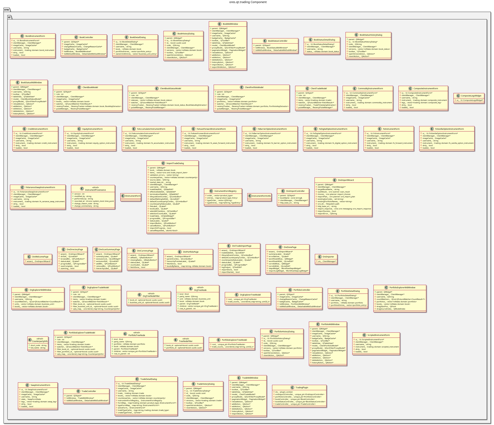

:PROPERTIES:
:ID: 3FA355D1-38FD-4E35-9E05-2185882B8AC1
:END:
#+title: ores.qt.trading
#+name: qt.trading
#+full_name: ores.qt.trading
#+description: Qt plugin for trading UI — portfolios, books, trades with multi-instrument forms, portfolio/org explorers, and ORE import.
#+type: ores.codegen.component
#+level: cross
#+filetags: :qt:trading:ui:component:
#+created: 2026-05-20
#+updated: 2026-05-20

* Diagram

#+attr_html: :width 100% :alt ores.qt.trading component diagram
#+caption: ores.qt.trading

* Summary

=ores.qt.trading= is the Qt plugin for the trading domain. It provides MDI
windows and dialogs for portfolios, books, book statuses, and trades, with
instrument-specific forms for FX (forwards, options, Asian, barrier, digital,
accumulator, variance swap), rates (IRS/swap, OIS, FRA), credit, equity,
commodity, and scripted instruments. It provides a Portfolio Explorer and Org
Explorer for hierarchical trade browsing, an ORE Import Wizard for bulk trade
loading, and contributes Import ORE Data to the Data Management menu.

* Inputs

- NATS responses from the trading service (portfolios, books, book statuses, trades).
- NATS responses from the refdata and market data services for instrument-form
  pickers and reference look-ups.
- ORE XML files supplied by the user for import.
- User interactions: create/edit/delete/view-history on trading entities.

* Outputs

- Rendered MDI windows for portfolios, books, trades, explorers, and import wizard.
- NATS request messages sent to the trading service on user actions.
- Import ORE Data menu item contributed to the Data Management menu.

* Entry points

- =include/ores.qt/TradingPlugin.hpp= — plugin class; owns Trading menu.
- =include/ores.qt/TradeController.hpp= — trade entity controller.
- =include/ores.qt/PortfolioController.hpp= — portfolio entity controller.
- =include/ores.qt/PortfolioExplorerMdiWindow.hpp= — tree-based portfolio explorer.
- =include/ores.qt/OreImportController.hpp= — ORE XML bulk import controller.

* Dependencies

- =ores.qt.api= — IPlugin, base controller/window/dialog classes, ClientManager.
- =ores.trading.api= — trade, portfolio, book domain types and NATS schemas.
- =ores.refdata.api= — reference data types used in instrument forms and pickers.
- =ores.ore.core= — ORE model types for import payload parsing.
- =ores.ore.api= — ORE API types.
- =ores.marketdata.api= — market data types used in trade valuation context.
- =ores.storage= — storage abstraction for trade data persistence.

* See also

- [[id:FD34A3B5-0E24-467A-A9D7-A2F2E7480E1B][ores.trading.api]] — trade, portfolio, book domain types and NATS schemas.
- [[id:654BE6CD-D212-4EE5-A7B4-8AF125787522][ores.refdata.api]] — reference data types used in instrument forms.
- [[id:0F93B352-F234-4D9D-82E6-05218BE645E8][ores.ore.api]] — ORE model integration types.
- [[id:9A71F1F5-C3ED-4C07-9D7D-C5B42D4A1332][ores.ore.core]] — ORE XML import/export for bulk trade loading.
- [[id:6A62D943-FAC9-4B77-9E22-F265557DCF1A][ores.marketdata.api]] — market data types used in trade context.
- [[id:92492264-B67A-4AC7-8A58-7D706D9F0DAB][ores.qt.data_management]] — receives Import ORE Data menu contribution.
- [[id:30A3A7F4-E1A9-42FB-AF9D-FF36FA0F3D21][ores.qt.api]] — shared Qt infrastructure and base classes.
- [[id:E81C7FEA-33E4-400A-839A-9D1618BED211][Qt Plugin Architecture]] — plugin lifecycle and menu-contribution model.
- [[id:FC186D19-9421-45A2-BBCC-4355D66AA41F][Entity Controller Pattern]] — controller/window/dialog/model structure.
