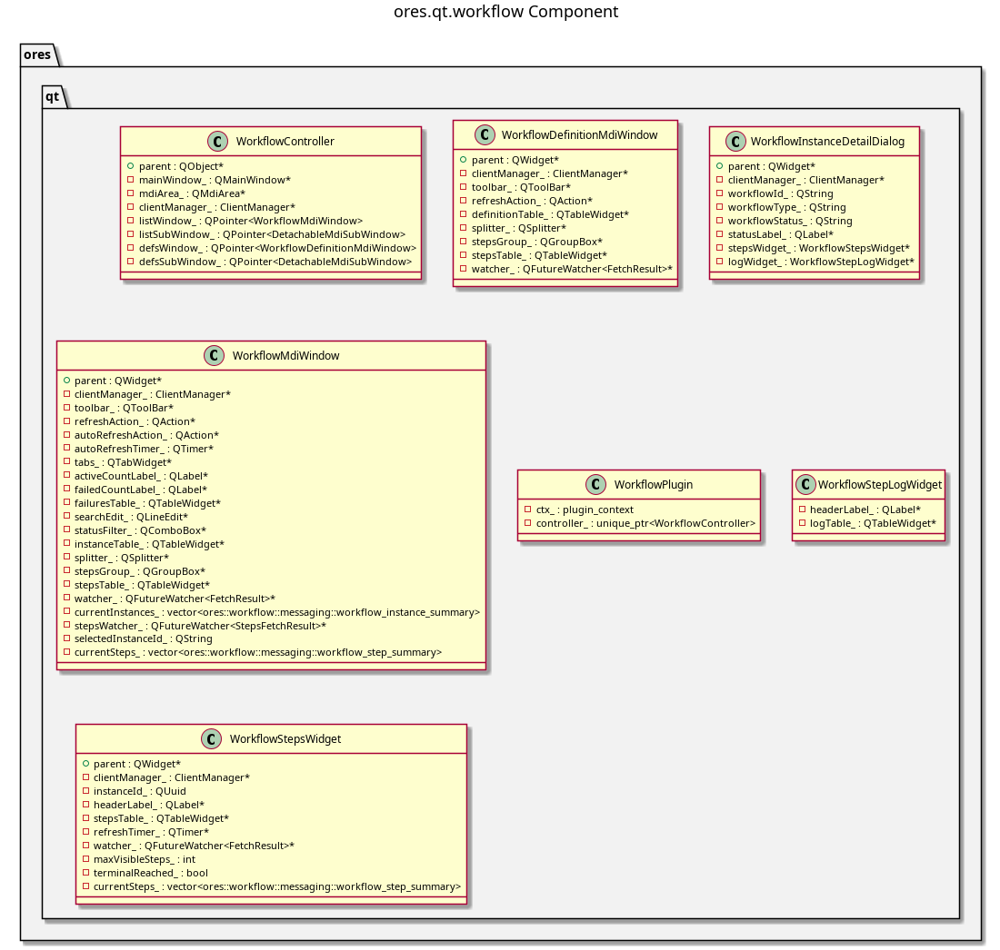

:PROPERTIES:
:ID: B7269E9C-83B6-4D6C-80DE-D796AB89B1BD
:END:
#+title: ores.qt.workflow
#+name: qt.workflow
#+full_name: ores.qt.workflow
#+description: Qt plugin for workflow UI — workflow executions and workflow definitions with step-log detail.
#+type: ores.codegen.component
#+level: cross
#+filetags: :qt:workflow:ui:component:
#+created: 2026-05-20
#+updated: 2026-05-20

* Diagram

#+attr_html: :width 100% :alt ores.qt.workflow component diagram
#+caption: ores.qt.workflow

* Summary

=ores.qt.workflow= is the Qt plugin for the workflow domain. It provides MDI
windows and dialogs for browsing workflow executions (instances) and workflow
definitions, with step-log detail views showing per-step progress and output.
It contributes Workflow Executions and Workflow Definitions items to the
Operations menu owned by =ores.qt.scheduler=.

* Inputs

- NATS responses from the workflow service (workflow executions, definitions,
  step logs).
- User interactions: view workflow execution state and step-level detail.
- =shared_menus_context.operations_menu= pointer for contributing items.

* Outputs

- Rendered MDI windows for workflow executions and definitions.
- NATS request messages sent to the workflow service on user actions.
- Workflow Executions and Workflow Definitions items contributed to the
  Operations menu.

* Entry points

- =include/ores.qt/WorkflowPlugin.hpp= — plugin class; contributes to Operations menu.
- =include/ores.qt/WorkflowController.hpp= — workflow execution controller.
- =include/ores.qt/WorkflowStepsWidget.hpp= — step-log detail widget.

* Dependencies

- =ores.qt.api= — IPlugin, base controller/window/dialog classes, ClientManager.
- =ores.workflow.api= — workflow execution and definition domain types and NATS schemas.

* See also

- [[id:85319483-4AE9-4162-91F7-D72A8201134B][ores.workflow.api]] — domain types and NATS protocol schemas for workflow.
- [[id:440294D7-385D-41EE-92CB-CAB937E65E81][ores.workflow.core]] — server-side workflow orchestration logic.
- [[id:4092E7E6-C663-4E5E-B330-63BFECE7CA51][ores.qt.scheduler]] — owns the Operations menu that workflow contributes to.
- [[id:30A3A7F4-E1A9-42FB-AF9D-FF36FA0F3D21][ores.qt.api]] — shared Qt infrastructure and base classes.
- [[id:E81C7FEA-33E4-400A-839A-9D1618BED211][Qt Plugin Architecture]] — plugin lifecycle and menu-contribution model.
- [[id:FC186D19-9421-45A2-BBCC-4355D66AA41F][Entity Controller Pattern]] — controller/window/dialog/model structure.
