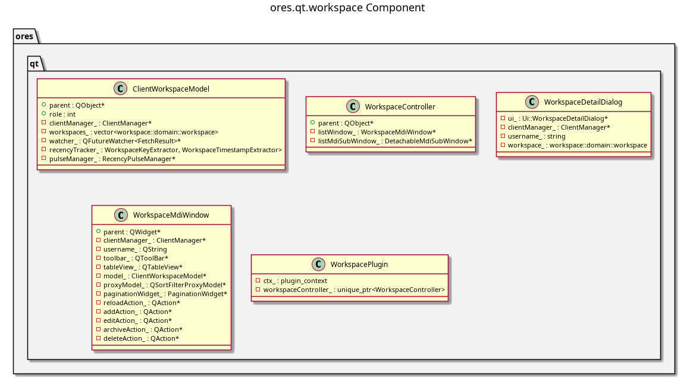

:PROPERTIES:
:ID: 31D9C75A-DE71-4B98-9D33-D8ED86000C94
:END:
#+title: ores.qt.workspace
#+name: qt.workspace
#+full_name: ores.qt.workspace
#+description: Qt plugin for workspace management UI — NATS-persisted workspaces that capture user session context.
#+type: ores.codegen.component
#+level: cross
#+filetags: :qt:workspace:ui:component:
#+created: 2026-05-20
#+updated: 2026-05-20

* Diagram

#+attr_html: :width 100% :alt ores.qt.workspace component diagram
#+caption: ores.qt.workspace

* Summary

=ores.qt.workspace= is the Qt plugin for workspace management. Workspaces are
NATS-persisted records that group a user's session context — active views,
preferences, and configuration state. The plugin provides an MDI window and
dialogs for creating, editing, and deleting workspaces. It contributes a
Manage Workspaces item to the Data Management menu owned by
=ores.qt.data_transfer=.

* Inputs

- NATS responses from the workspace service (workspace records).
- User interactions: create/edit/delete workspaces.
- =shared_menus_context.data_management_menu= pointer for contributing items.

* Outputs

- Rendered MDI window for workspace management.
- NATS request messages sent to the workspace service on user actions.
- Manage Workspaces item contributed to the Data Management menu.

* Entry points

- =include/ores.qt/WorkspacePlugin.hpp= — plugin class; contributes to Data Management menu.
- =include/ores.qt/WorkspaceController.hpp= — workspace entity controller.

* Dependencies

- =ores.qt.api= — IPlugin, base controller/window/dialog classes, ClientManager.
- =ores.workspace.api= — workspace domain types and NATS schemas.

* See also

- [[id:92492264-B67A-4AC7-8A58-7D706D9F0DAB][ores.qt.data_transfer]] — owns the Data Management menu that workspace contributes to.
- [[id:30A3A7F4-E1A9-42FB-AF9D-FF36FA0F3D21][ores.qt.api]] — shared Qt infrastructure and base classes.
- [[id:E81C7FEA-33E4-400A-839A-9D1618BED211][Qt Plugin Architecture]] — plugin lifecycle and menu-contribution model.
- [[id:FC186D19-9421-45A2-BBCC-4355D66AA41F][Entity Controller Pattern]] — controller/window/dialog/model structure.
