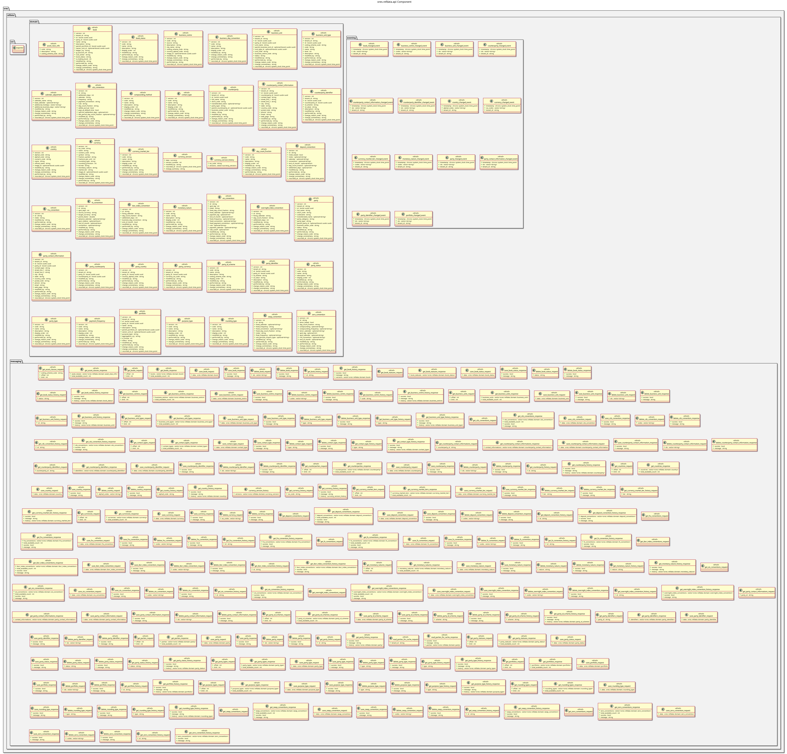

:PROPERTIES:
:ID: 654BE6CD-D212-4EE5-A7B4-8AF125787522
:END:
#+title: ores.refdata.api
#+name: refdata.api
#+full_name: ores.refdata.api
#+description: Domain types, JSON/CSV/table I/O, and NATS protocol schemas for the reference-data component.
#+type: ores.codegen.component
#+level: cross
#+filetags: :refdata:api:component:
#+created: 2026-05-19
#+updated: 2026-05-19

* Diagram

#+attr_html: :width 100% :alt ores.refdata.api component diagram
#+caption: ores.refdata.api

* Summary

=ores.refdata.api= is a header-only library defining the shared contract for
the reference-data domain. It provides over 150 domain types for currencies,
countries, counterparties, books, business units, business centres, and trading
structure entities, together with JSON, table, and CSV I/O generated via =rfl=,
and the NATS message protocol schemas for the 0x3000–0x3FFF range. All
consumers of reference data (=ores.trading.api=, Qt clients, peer services)
depend on this library.

* Inputs

- Domain entity type definitions across =domain/= headers.
- NATS protocol message definitions.

* Outputs

- C++ headers for all reference-data domain types with JSON, table, and CSV
  I/O variants.
- NATS protocol headers covering the 0x3000–0x3FFF message range.

* Entry points

- =include/ores.refdata.api/domain/= — all domain entity headers (~148 types).
- =include/ores.refdata.api/messaging/= — NATS protocol message headers.

* Dependencies

- =rfl= — JSON serialisation and table output via C++ reflection.
- =fort= — formatted table rendering.

* See also

- [[id:D774690E-B214-42B0-94FC-B636C49F6F37][ores.refdata]] — component group overview.

- [[id:204DB292-C32B-03E4-9DDB-BFE634F7CE91][ores.refdata.core]] — business logic, persistence, and NATS handlers.
- [[id:C2B3D4E5-F6A7-8901-BCDE-F12345678901][ores.refdata Messaging Reference]] — full NATS subject and message catalogue.
