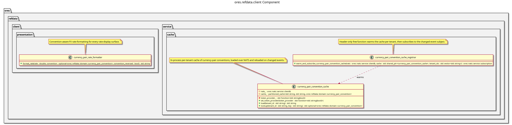

:PROPERTIES:
:ID: C32C4A3B-1B34-4A4A-A71D-62F25AA874E7
:END:
#+title: ores.refdata.client
#+description: Client-side NATS wrapper for the refdata service used by non-Qt consumers.
#+type: ores.codegen.component
#+level: cross
#+filetags: 
#+created: 2026-07-29
#+updated: 2026-07-29
#+name: refdata.client
#+full_name: ores.refdata.client
#+brief: Reference data client

* Diagram

#+attr_html: :width 100% :alt ores.refdata.client component diagram
#+caption: ores.refdata.client

* Summary

(Three to five sentences: what this component does and why it exists.)

* Inputs

-

* Outputs

-

* Entry points

-

* Dependencies

-

* See also

-
