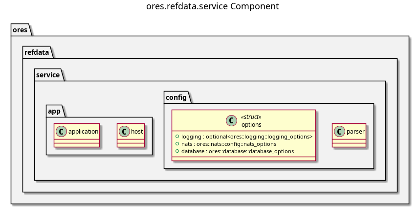

:PROPERTIES:
:ID: E75568D2-588A-4FE2-9ED1-6826B60C0E10
:END:
#+title: ores.refdata.service
#+description: NATS service entrypoint for the reference-data domain — wires handlers, repositories, and configuration.
#+type: ores.codegen.component
#+level: cross
#+filetags: :refdata:service:component:
#+created: 2026-05-19
#+updated: 2026-05-19
#+name: refdata.service
#+full_name: ores.refdata.service
#+brief: Reference data service

* Diagram

#+attr_html: :width 100% :alt ores.refdata.service component diagram
#+caption: ores.refdata.service

* Summary

=ores.refdata.service= is the NATS service entrypoint for the reference-data
domain. It reads configuration, opens database and NATS connections, registers
all message handlers from =ores.refdata.core=, and runs the event loop. All
business logic lives in =ores.refdata.core=; this component is responsible only
for bootstrap, dependency injection, and graceful shutdown.

* Inputs

- Configuration file: NATS server URL, PostgreSQL connection string, and
  environment settings.
- NATS request messages from Qt clients and peer services on the
  =ores.refdata.*= subject hierarchy (0x3000–0x3FFF range).

* Outputs

- A running NATS service handling all reference-data operations.
- NATS response messages returned to callers.
- Structured logs via =ores.logging=.

* Entry points

- =src/main.cpp= — process entry point.
- =src/app/= — application bootstrap and dependency injection.
- =src/config/= — configuration parsing and validation.

* Dependencies

- =ores.refdata.core= — all NATS handlers, repositories, and domain services.
- =ores.refdata.api= — shared protocol types.
- =ores.logging= — structured logging infrastructure.
- =nats.c= — NATS client for connection management.

* See also

- [[id:D774690E-B214-42B0-94FC-B636C49F6F37][ores.refdata]] — component group overview.

- [[id:204DB292-C32B-03E4-9DDB-BFE634F7CE91][ores.refdata.core]] — all business logic for the reference-data domain.
