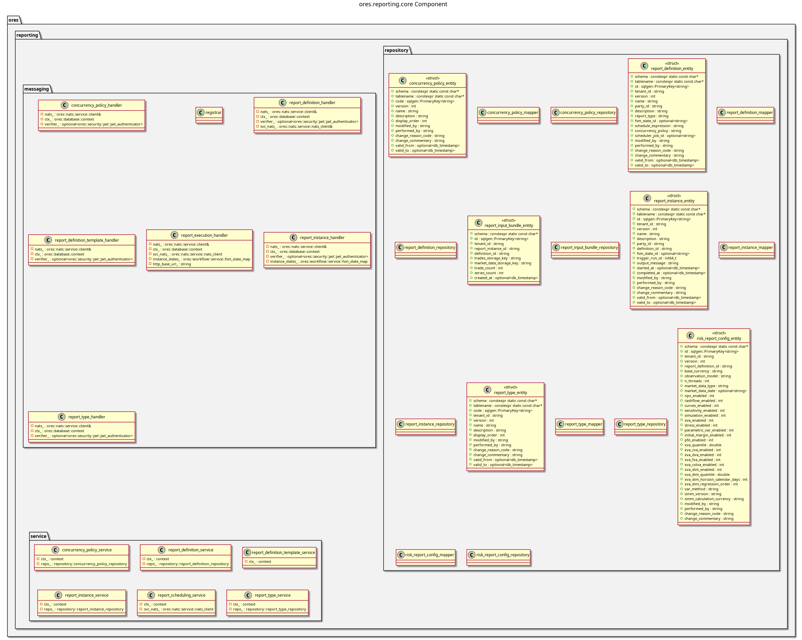

:PROPERTIES:
:ID: D65B6932-7A33-471C-98C6-6AC345D4684C
:END:
#+title: ores.reporting.core
#+description: Report management and ORE risk execution — report types, definitions, instances, and scheduling.
#+type: component
#+version: 2
#+level: cross
#+filetags: :reporting:core:component:
#+created: 2026-05-19
#+updated: 2026-05-19

* Diagram

#+attr_html: :width 100% :alt ores.reporting.core component diagram
#+caption: ores.reporting.core

* Summary

=ores.reporting.core= manages the report lifecycle in ORE Studio: report-type
definitions (e.g., NPV cube, trade cashflows, XVA), parameterised report
definitions, execution instances with concurrency policies, and run history.
It exposes NATS handlers for report CRUD and triggering ORE risk runs, and
persists all report metadata to the =ores_reporting= schema.

* Inputs

- NATS request messages for report-type, definition, and instance management.
- PostgreSQL connections to =ores_reporting_*= tables.
- ORE risk-engine invocations triggered by the scheduler or client requests.

* Outputs

- Report-definition and run-instance records persisted to the =ores_reporting=
  schema.
- ORE output files (NPV cube, cashflows) made available to Qt clients.
- NATS response messages returned to callers.

* Entry points

- =include/ores.reporting.core/ores.reporting.core.hpp= — aggregate include.
- =include/ores.reporting.core/messaging/registrar.hpp= — registers all NATS
  handlers with the service host.
- =include/ores.reporting.core/service/= — per-entity service headers.

* Dependencies

- =ores.reporting.api= — shared domain types and NATS protocol schemas.
- =ores.dq= — ORM base classes and persistence infrastructure.
- =ores.iam.core= — identity and authorisation context.
- =rfl= — JSON serialisation via reflection.
- =soci= — SQL ORM for PostgreSQL persistence.
- =nats.c= — NATS messaging client.

* See also

- [[id:e5ac5738-0694-494e-823e-0322f4902ad2][ores.reporting.api]] — protocol types and domain entities.
- [[id:544947d0-7e23-4145-8f62-ec8341ed42ff][ores.reporting.service]] — NATS service entrypoint.
- [[id:B1A5C952-B709-444B-8A63-5FD834D87D52][ores.reporting Messaging Reference]] — full NATS subject and message catalogue.
