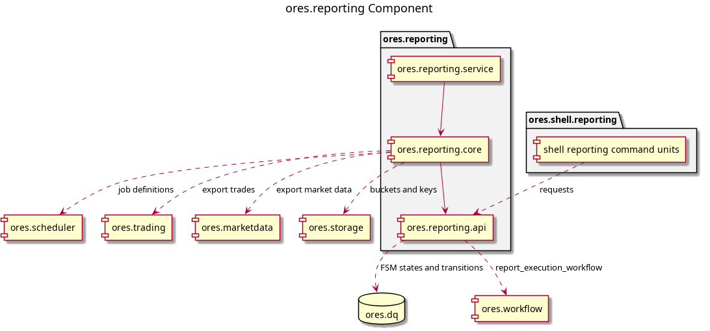

:PROPERTIES:
:ID: F1B83A47-E029-4D78-9A56-31B7CFE49265
:END:
#+title: ores.reporting
#+description: Provides domain types, repositories, services and protocol support for report management including report definitions, risk report configurations and report instances.
#+type: ores.codegen.component
#+level: cross
#+component_kind: composite
#+parts: api core service
#+filetags: :reporting:component:
#+created: 2026-06-02
#+updated: 2026-09-26
#+name: reporting
#+full_name: ores.reporting
#+brief: Reporting domain component

* Diagram

* Summary

=ores.reporting= decides what a report is, when it runs, and what happened when
it did. It owns report definitions, report types, concurrency policies, risk
report configurations, report instances and the input bundles an execution
gathers.

It is a composite: the component has no code of its own, and every generated and
hand-written artefact lives under one of the three parts below.

A report instance moves through the =report_instance_lifecycle= state machine,
which the component seeds. The states and transitions live in =ores.dq=, and a
trigger on the instances table refuses a state change the machine does not
allow.

* Inputs

- NATS requests for the entity verbs of its six models: report types, report
  definitions, report instances, concurrency policies, risk report
  configurations, and the report definition templates it forwards to =ores.dq=.
- =reporting.v1.ops.trigger_report_instance= -- the scheduler sends it when a
  report job fires, and the shell sends it by hand. It carries the definition,
  the tenant that owns it and the scheduler run.
- DQ artefacts published into report definitions by the provisioning flow.
- Workflow step completions from =ores.workflow=, and batch completions from
  =ores.compute=, which resume a report that is waiting on the grid.

* Outputs

- =report_instance= rows and their =report_input_bundle= rows.
- =report_execution_workflow= starts, dispatched to =ores.workflow=.
- Storage buckets and keys handed to =ores.trading= and =ores.marketdata=,
  which write the gathered trades and market data themselves.
- Scheduler job definitions, through =ores.scheduler=.
- Entity change events for the four models that carry them.

* Entry points

- =projects/ores.reporting/api/= -- domain types, JSON and table I/O, the NATS
  protocols, and the workflow definition.
- =projects/ores.reporting/core/= -- repositories, services, the messaging
  handlers and the component registrar.
- =projects/ores.reporting/service/= -- =ores.reporting.service=, the process
  that owns the subscriptions.
- =projects/ores.shell/reporting/= -- the shell command units that drive all of
  the above, including the trigger operation.

* Dependencies

- =ores.dq= -- the FSM machines, states and transitions the lifecycle binds to.
- =ores.workflow= -- the engine that runs a report execution.
- =ores.scheduler.api= -- the job definitions the component creates and removes.
- =ores.trading.api= and =ores.marketdata.api= -- the export requests that
  gather a report's inputs.
- =ores.storage= and =ores.http.server= -- where those exports land.
- =ores.service= -- the runner, request context and messaging helpers every
  handler uses.
- =ores.security= and =ores.iam.client= -- the JWT verifier and the service
  token the component presents to its peers.

* See also

- [[id:32055CB5-7CA1-4204-8A8E-88DCAC7CB585][Clean ores.reporting to the component clean standard]] -- the pass that
  brought the component to the standard.
- [[id:7B477025-132E-4B20-80B4-D8C9420880B8][Component Clean Standard]] -- the checklist each item is recorded against.
- [[id:C650CBC9-FDED-4C68-981F-7902E296928E][NATS entity protocol specification]] -- the subject grammar the component
  follows, and the operation rules its trigger obeys.
- [[id:3361CF92-89B0-481E-9E51-ACE2FEEF2FAA][Journey execution]] -- why a report execution is a workflow rather than a
  coordinator.
