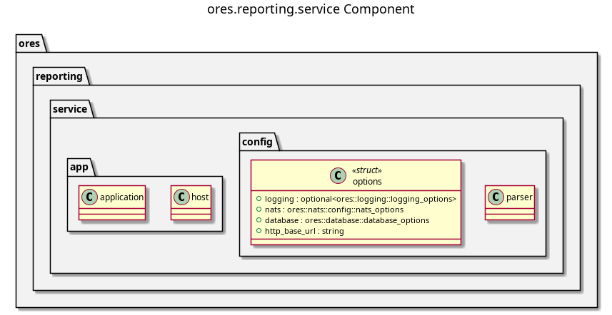

:PROPERTIES:
:ID: 544947D0-7E23-4145-8F62-EC8341ED42FF
:END:
#+title: ores.reporting.service
#+description: NATS service entrypoint for the reporting domain.
#+type: ores.codegen.component
#+level: cross
#+filetags: :reporting:service:component:
#+created: 2026-05-19
#+updated: 2026-05-19
#+name: reporting.service
#+full_name: ores.reporting.service
#+brief: Reporting service

* Diagram

#+attr_html: :width 100% :alt ores.reporting.service component diagram
#+caption: ores.reporting.service

* Summary

=ores.reporting.service= is the NATS service entrypoint for the reporting
domain. It reads configuration, opens database and NATS connections, registers
all message handlers from =ores.reporting.core=, and runs the event loop.
All business logic lives in =ores.reporting.core=.

* Inputs

- Configuration file: NATS server URL, PostgreSQL connection string, and
  environment settings.
- NATS request messages for report management operations.

* Outputs

- A running NATS service handling all reporting operations.
- NATS response messages returned to callers.
- Structured logs via =ores.logging=.

* Entry points

- =src/main.cpp= — process entry point.
- =src/app/= — application bootstrap and dependency injection.
- =src/config/= — configuration parsing and validation.

* Dependencies

- =ores.reporting.core= — all NATS handlers, repositories, and domain services.
- =ores.reporting.api= — shared protocol types.
- =ores.logging= — structured logging infrastructure.
- =nats.c= — NATS client for connection management.

* See also

- [[id:F1B83A47-E029-4D78-9A56-31B7CFE49265][ores.reporting]] — component group overview.

- [[id:D65B6932-7A33-471C-98C6-6AC345D4684C][ores.reporting.core]] — all business logic for the reporting domain.
