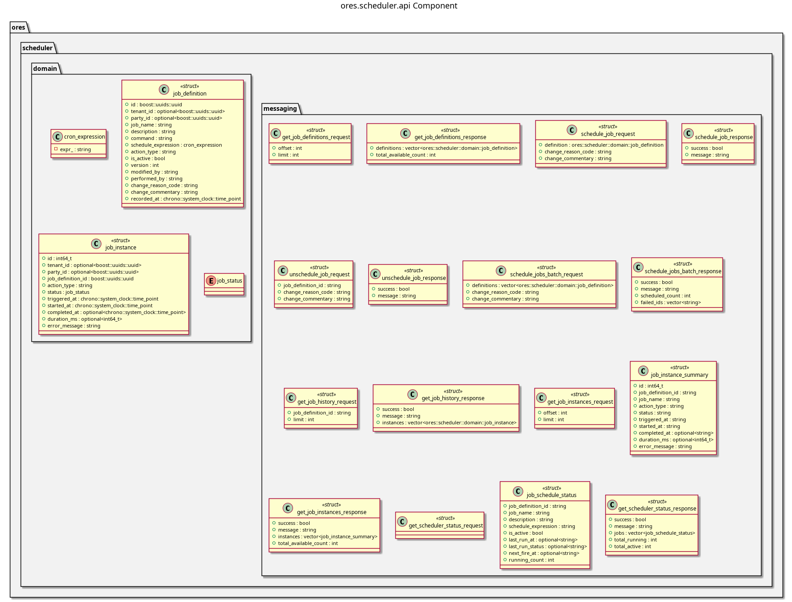

:PROPERTIES:
:ID: B49ED6E9-20DC-421F-A0F9-D7EAB6B54F9B
:END:
#+title: ores.scheduler.api
#+name: scheduler.api
#+full_name: ores.scheduler.api
#+description: Domain types and NATS protocol schemas for the scheduler component.
#+type: ores.codegen.component
#+level: cross
#+filetags: :scheduler:api:component:
#+created: 2026-05-19
#+updated: 2026-05-19

* Diagram

#+attr_html: :width 100% :alt ores.scheduler.api component diagram
#+caption: ores.scheduler.api

* Summary

=ores.scheduler.api= is a header-only library defining the shared contract for
the scheduler domain. It provides domain types for job definitions (cron
expressions, action types), job instances (execution records), and job status
values, together with JSON and table I/O via =rfl=, and the NATS protocol
schemas consumed by =ores.scheduler.core= and any client managing scheduled
jobs.

* Inputs

- Domain entity type definitions: =job_definition.hpp=, =job_instance.hpp=,
  =job_status.hpp=, =cron_expression.hpp=.

* Outputs

- C++ headers for scheduler domain types with JSON and table I/O.
- NATS protocol headers for job-definition and job-instance operations.

* Entry points

- =include/ores.scheduler.api/domain/= — all domain entity headers.
- =include/ores.scheduler.api/messaging/= — NATS protocol message headers.

* Dependencies

- =rfl= — JSON serialisation via reflection.
- =fort= — formatted table rendering.

* See also

- [[id:B788F24E-2E3F-432A-BD4F-CA8D6EBB2C9D][ores.scheduler]] — component group overview.

- [[id:2F7E5268-1ECF-4F5B-B90F-EC916559DE54][ores.scheduler.core]] — business logic, scheduling loop, and NATS handlers.
- [[id:220199A4-5460-491F-AF48-6264D721C25D][ores.scheduler Messaging Reference]] — full NATS subject and message catalogue.
