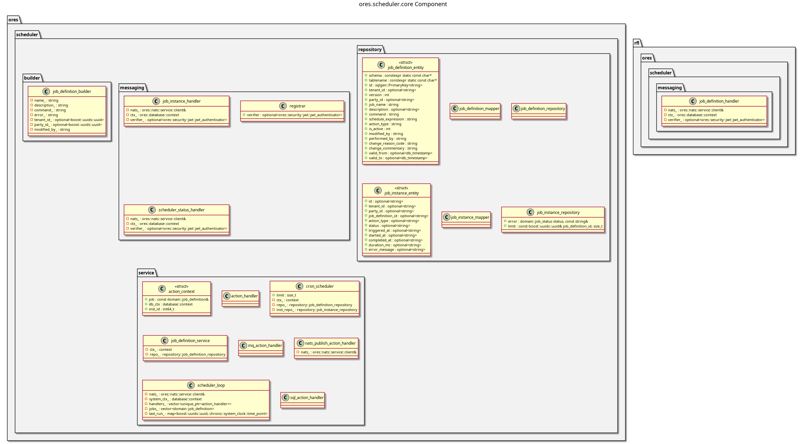

:PROPERTIES:
:ID: 2F7E5268-1ECF-4F5B-B90F-EC916559DE54
:END:
#+title: ores.scheduler.core
#+name: scheduler.core
#+full_name: ores.scheduler.core
#+description: Job scheduling infrastructure — cron-based job definitions, execution, and scheduling for periodic operations.
#+type: ores.codegen.component
#+level: cross
#+filetags: :scheduler:core:component:
#+created: 2026-05-19
#+updated: 2026-05-19

* Diagram

#+attr_html: :width 100% :alt ores.scheduler.core component diagram
#+caption: ores.scheduler.core

* Summary

=ores.scheduler.core= provides cron-based job scheduling for ORE Studio. It
manages job definitions (cron expressions, target actions) and job instances
(execution history, status), runs a persistent scheduler loop that fires due
jobs, and exposes NATS handlers for querying and managing jobs at runtime. It
supports SQL, NATS-publish, and message-queue action types, making it the
general-purpose periodic-operation backbone for the platform.

* Inputs

- NATS request messages for job-definition CRUD and instance queries.
- PostgreSQL connections to =ores_scheduler_*= tables for job persistence.
- System clock for evaluating cron expressions.

* Outputs

- Job-definition and job-instance records persisted to the =ores_scheduler=
  schema.
- Triggered actions: SQL statements executed, NATS messages published, or MQ
  actions dispatched per job schedule.
- NATS response messages returned to callers.

* Entry points

- =include/ores.scheduler.core/ores.scheduler.hpp= — aggregate include.
- =include/ores.scheduler.core/messaging/registrar.hpp= — registers all NATS
  handlers.
- =include/ores.scheduler.core/service/scheduler_loop.hpp= — the main
  scheduling loop driven by the service host.
- =include/ores.scheduler.core/builder/job_definition_builder.hpp= — fluent
  builder for creating job definitions programmatically.

* Dependencies

- =ores.scheduler.api= — shared domain types and NATS protocol schemas.
- =ores.dq= — ORM base classes and persistence infrastructure.
- =ores.iam.core= — identity and authorisation context.
- =rfl= — JSON serialisation via reflection.
- =soci= — SQL ORM for PostgreSQL persistence.
- =nats.c= — NATS messaging client.

* See also

- [[id:B788F24E-2E3F-432A-BD4F-CA8D6EBB2C9D][ores.scheduler]] — component group overview.

- [[id:B49ED6E9-20DC-421F-A0F9-D7EAB6B54F9B][ores.scheduler.api]] — protocol types and domain entities.
- [[id:86B4ECD8-FF01-438A-99BB-55B4CA523AED][ores.scheduler.service]] — NATS service entrypoint.
- [[id:220199A4-5460-491F-AF48-6264D721C25D][ores.scheduler Messaging Reference]] — full NATS subject and message catalogue.
