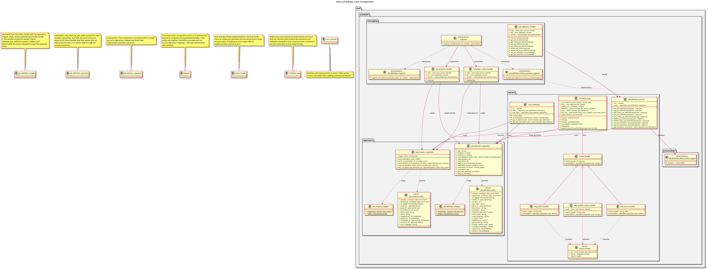

:PROPERTIES:
:ID: 2F7E5268-1ECF-4F5B-B90F-EC916559DE54
:END:
#+title: ores.scheduler.core
#+name: scheduler.core
#+full_name: ores.scheduler.core
#+description: Job scheduling infrastructure — cron-based job definitions, execution, and scheduling for periodic operations.
#+type: ores.codegen.component
#+level: cross
#+filetags: :scheduler:core:component:
#+created: 2026-05-19
#+updated: 2026-05-19

* Diagram

#+attr_html: :width 100% :alt ores.scheduler.core component diagram
#+caption: ores.scheduler.core

* Summary

=ores.scheduler.core= provides cron-based job scheduling for ORE Studio. It
manages job definitions (cron expressions, target actions) and job instances
(execution history, status), runs a persistent scheduler loop that fires due
jobs, and exposes NATS handlers for querying and managing jobs at runtime. It
supports SQL and NATS-publish action types, making it the general-purpose
periodic-operation backbone for the platform.

The job-definition entity stack -- repository, mapper, entity, service,
handler, sub-registrar, history provider and the presentation field mapper --
is generated from the entity model. The hand-written code here is the
infrastructure generation does not reach: the scheduler loop, the cron
evaluator, the action handlers, the messaging registrar that composes the
generated sub-registrar with the two hand-written view handlers, and the
job-instance repository.

* Inputs

- NATS request messages for job-definition CRUD, the version reads, the two
  operational views, and the executions the loop serves.
- PostgreSQL connections to =ores_scheduler_*= tables for job persistence.
- System clock for evaluating cron expressions.

* Outputs

- Job-definition and job-instance records persisted to the =ores_scheduler=
  schema.
- Triggered actions: SQL statements executed, or NATS messages published, per
  job schedule.
- NATS response messages returned to callers, and a change event per job
  definition write.

* Entry points

- =include/ores.scheduler.core/ores.scheduler.hpp= — namespace documentation.
- =include/ores.scheduler.core/messaging/registrar.hpp= — composes every NATS
  handler the component serves: the generated job-definition registrar, the
  two view handlers, and the generic history handler.
- =include/ores.scheduler.core/messaging/job_definition_registrar.hpp= — the
  generated job-definition handlers.
- =include/ores.scheduler.core/messaging/job_instance_handler.hpp= — the global
  job-instance list.
- =include/ores.scheduler.core/messaging/scheduler_status_handler.hpp= — the
  live scheduler status.
- =include/ores.scheduler.core/service/scheduler_loop.hpp= — the main
  scheduling loop driven by the service host.

* Dependencies

- =ores.scheduler.api= — domain types, the generated protocol, and the
  generated entity artefacts.
- =ores.database= — connections, the request context, and the bitemporal
  repository operations.
- =ores.nats= — NATS client, subscriptions and wire codec.
- =ores.service= — request context, handler helpers and permission checks.
- =ores.history.core= — the generic history provider registry.
- =ores.eventing.api= — the change event published when a job fires.
- =ores.utility=, =ores.security=, =ores.logging=, =ores.platform= — shared
  types, token validation, logging and time formatting.
- =croncpp= — cron expression parsing and next-occurrence computation.
- =libfort= — the table rendering of the domain types.

* See also

- [[id:B788F24E-2E3F-432A-BD4F-CA8D6EBB2C9D][ores.scheduler]] — component group overview.

- [[id:B49ED6E9-20DC-421F-A0F9-D7EAB6B54F9B][ores.scheduler.api]] — protocol types and domain entities.
- [[id:86B4ECD8-FF01-438A-99BB-55B4CA523AED][ores.scheduler.service]] — NATS service entrypoint.
- [[id:220199A4-5460-491F-AF48-6264D721C25D][ores.scheduler Messaging Reference]] — full NATS subject and message catalogue.
