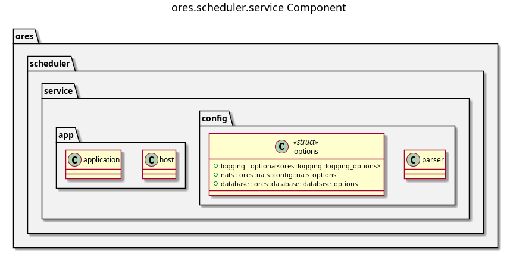

:PROPERTIES:
:ID: 86B4ECD8-FF01-438A-99BB-55B4CA523AED
:END:
#+title: ores.scheduler.service
#+description: NATS service entrypoint for the scheduler domain — wires job handlers and runs the cron loop.
#+type: ores.codegen.component
#+level: cross
#+filetags: :scheduler:service:component:
#+created: 2026-05-19
#+updated: 2026-05-19
#+name: scheduler.service
#+full_name: ores.scheduler.service
#+brief: Scheduler service

* Diagram

#+attr_html: :width 100% :alt ores.scheduler.service component diagram
#+caption: ores.scheduler.service

* Summary

=ores.scheduler.service= is the NATS service entrypoint for the scheduler
domain. It reads configuration, opens database and NATS connections, starts
the cron-based scheduler loop from =ores.scheduler.core=, registers all
message handlers, and runs the event loop. All scheduling logic lives in
=ores.scheduler.core=.

* Inputs

- Configuration file: NATS server URL, PostgreSQL connection string, and
  environment settings.
- NATS request messages for job-definition and job-instance management.
- System clock — the scheduler loop fires due jobs based on cron expressions.

* Outputs

- A running NATS service handling all scheduler management operations.
- Periodic job executions (SQL, NATS-publish, MQ actions) fired on schedule.
- NATS response messages returned to callers.
- Structured logs via =ores.logging=.

* Entry points

- =src/main.cpp= — process entry point.
- =src/app/= — application bootstrap, starts the scheduler loop.
- =src/config/= — configuration parsing and validation.

* Dependencies

- =ores.scheduler.core= — all handlers, job-dispatch logic, and cron loop.
- =ores.scheduler.api= — shared protocol types.
- =ores.logging= — structured logging infrastructure.
- =nats.c= — NATS client for connection management.

* See also

- [[id:B788F24E-2E3F-432A-BD4F-CA8D6EBB2C9D][ores.scheduler]] — component group overview.

- [[id:2F7E5268-1ECF-4F5B-B90F-EC916559DE54][ores.scheduler.core]] — all business logic for the scheduler domain.
