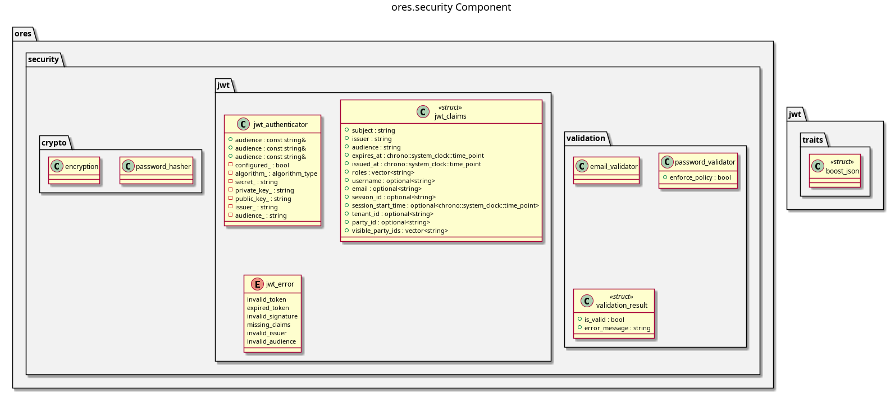

:PROPERTIES:
:ID: D7BCB9B1-43C9-4DEF-8B1D-BABD23494DC2
:END:
#+title: ores.security
#+name: security
#+full_name: ores.security
#+description: Shared cryptographic primitives — scrypt password hashing, AES-256-GCM encryption, and OWASP password validation.
#+type: ores.codegen.component
#+level: cross
#+filetags: :security:crypto:component:
#+created: 2026-05-20
#+updated: 2026-05-20

* Diagram

#+attr_html: :width 100% :alt ores.security component diagram
#+caption: ores.security

* Summary

=ores.security= provides the shared cryptographic primitives for ORE Studio.
It covers scrypt password hashing with OWASP-recommended parameters, AES-256-GCM
symmetric encryption with PBKDF2 key derivation, JWT token parsing/validation,
and input validation for passwords (OWASP policy: 12+ chars, mixed case, digit,
special) and email formats. All OpenSSL resources are managed via RAII. It is
used by =ores.iam= for authentication and by =ores.connections= for credential
encryption.

* Inputs

- Plaintext passwords and salts for hashing or key derivation.
- Ciphertext and encryption keys for AES-256-GCM decryption.
- JWT tokens (Base64url-encoded) for signature validation.

* Outputs

- scrypt password hashes for storage.
- AES-256-GCM encrypted/decrypted byte sequences.
- Validated JWT claims or validation errors.
- Password and email policy validation results.

* Entry points

- =include/ores.security/crypto/= — scrypt hashing and AES-256-GCM.
- =include/ores.security/jwt/= — JWT parsing and validation.
- =include/ores.security/validation/= — password policy and email validators.

* Dependencies

- OpenSSL — scrypt, AES-GCM, PBKDF2, and JWT signature primitives.

* See also

-
