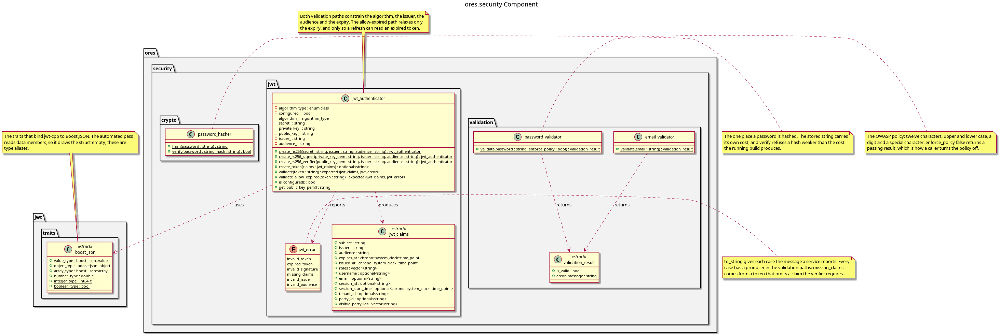

:PROPERTIES:
:ID: D7BCB9B1-43C9-4DEF-8B1D-BABD23494DC2
:END:
#+title: ores.security
#+name: security
#+full_name: ores.security
#+description: Shared security primitives: scrypt password hashing and verification, JWT signing and validation, and the OWASP password and email validators.
#+type: ores.codegen.component
#+level: cross
#+filetags: :security:crypto:component:
#+created: 2026-05-20
#+updated: 2026-09-26

* Diagram

#+attr_html: :width 100% :alt ores.security component diagram
#+caption: ores.security

* Summary

=ores.security= holds the security primitives the tree shares: the scrypt
password hash, JWT signing and validation, and the policy validators for
passwords and email addresses. It owns no entity, no protocol and no
subject, so nothing here is generated and nothing here appears on the wire
except the tokens it mints and reads.

The JWT facet is the component's public face by a wide margin: 441 C++ files
outside the component include =jwt_authenticator.hpp=, because every service
validates the tokens IAM issues. The rest is narrow: =password_hasher.hpp=
reaches 4 files, =jwt_claims.hpp= 7, =jwt_error.hpp= 2, and the two
validators 2 each. The password hash and the validators are IAM's bootstrap
handler, account operations and signup services, and one build helper in
=ores.web=; the claims reach IAM's auth and account handlers, the HTTP
request shape, and the synthetic feed handlers.

The component is cryptographic, so the cost of a hash and the reach of a
token are its two policy surfaces, and both are pinned by tests rather than
by convention.

* Facets

- =crypto/= — =password_hasher=, the scrypt hash and its verification. The
  hash string carries its own parameters in the
  =$scrypt$ln=14,r=8,p=1$<salt>$<hash>= form, so a stored hash states the
  cost it was made with. Production uses ln=14, the OWASP-recommended cost;
  =ORES_TEST_PASSWORD_FAST= selects ln=10 for the suite. Verification
  refuses a stored hash weaker than the cost the running build produces, so
  a downgraded hash cannot be used to make an offline attack cheap.
- =jwt/= — =jwt_authenticator= signs with HS256 or RS256 and validates with
  either, constraining the algorithm, the issuer, the audience and the
  expiry, and reporting which of those failed through =jwt_error=.
  =jwt_claims= is the shaped claim set the rest of the tree reads, and
  =boost_json_traits= binds jwt-cpp to Boost.JSON.
- =validation/= — =password_validator= applies the OWASP policy (at least 12
  characters, upper and lower case, a digit and a special character), and
  =email_validator= checks the shape of an address. Both return
  =validation_result=, which carries the verdict and the reason.

* Inputs

- A plaintext password to hash, and a password plus a stored hash to verify.
- A =jwt_claims= to sign, and a token to validate.
- A candidate password or email address for the policy validators.

* Outputs

- A scrypt hash string, or a boolean verification verdict.
- A signed token, or the validated claims.
- The =jwt_error= case that stopped validation, when one did.
- A =validation_result= carrying the verdict and, when invalid, the reason.

* Entry points

- =include/ores.security/ores.security.hpp= — the namespace documentation
  header, whose =@brief= is this component's doxygen description.
- =include/ores.security/crypto/password_hasher.hpp= — =hash=, =verify=.
- =include/ores.security/jwt/jwt_authenticator.hpp= — =create_hs256=,
  =create_rs256_signer=, =create_rs256_verifier=, =create_token=,
  =validate=, =validate_allow_expired=.
- =include/ores.security/jwt/jwt_claims.hpp= — =jwt_claims=.
- =include/ores.security/jwt/jwt_error.hpp= — =jwt_error=, =to_string=.
- =include/ores.security/validation/password_validator.hpp= — the password
  policy.
- =include/ores.security/validation/email_validator.hpp= — the email shape.
- =include/ores.security/validation/validation_result.hpp= — the verdict
  type both validators return.

* Dependencies

- =OpenSSL= — scrypt, the random salt, and the RSA and HMAC primitives the
  JWTs are signed with.
- =jwt-cpp=, over the =boost-json= traits — token creation, decoding and the
  claim checks.
- =ores.utility= — the Base64 codec the hash string and the tokens use.
- =ores.platform= — the environment the fast-hash test flag is read from.
- =ores.logging= — the logger each facet writes to.

* Recorded findings

- *The validation error mapping was unreachable.* =validate= and
  =validate_allow_expired= mapped jwt-cpp failures by searching the
  exception message for words such as "issuer" and "signature", and
  jwt-cpp's messages do not contain them, so every failure was reported as
  =invalid_token= and the named cases were dead. Both now map from
  jwt-cpp's =token_verification_error= code and from the signature
  exception type, and each case has a test.
- *=validate_allow_expired= did not check the audience.* The refresh path
  relaxed the expiry and, in doing so, skipped the audience constraint
  =validate= applies, so a token minted for another service was accepted
  while the signature and issuer matched. It checks the audience now.
- *No not-before claim is ever set.* The survey asked for an =nbf= test;
  =create_token= sets only =iat= and =exp=, so the not-yet-valid path cannot
  be reached through this API at all. Recorded rather than tested, because
  a test would have to fake the claim through jwt-cpp directly and would
  prove nothing about this component.
- *=crypto/encryption= is gone.* It carried the component's only
  AES-256-GCM and PBKDF2 surface, and no file in the tree included it: its
  own test was the only consumer. It was deleted with that test rather than
  kept as an unused capability.
- *The namespace header stays.* =ores.security.hpp= documents the
  =ores::security= namespace for doxygen, and the diagram conventions read
  its =@brief= when they label the component, so a consumer census does not
  apply to it. G08 of the Component Clean Standard states that for every
  component.

* See also

- [[id:45CAC01F-BC56-4600-B206-EEE7545AE3AB][Component Architecture Audit]] -- the structural checklist and the placement rules this component is measured against.
- [[id:7B477025-132E-4B20-80B4-D8C9420880B8][Component Clean Standard]] -- the checklist this component was worked through.
- [[id:B079DA67-8408-4BD0-A93C-D108AC780872][Facet]] -- the catalogue that fixes the facet folder names above.
- [[id:B9D3D469-9E59-465F-8C18-34546B680D13][Component Documentation Guide]] -- what fills this overview well.
- [[id:271F40DA-D0EA-4D08-A4F8-3D2B835DF5E7][PlantUML class diagram conventions]] -- the rules the component diagram follows.
- [[id:FB797194-EB03-4837-B12D-E651DD5F16F2][Unit test conventions]] -- the Catch2 conventions the component's tests follow.
- [[id:0FB2EA84-EBB8-45C8-A8C8-F5815431C2D2][Code Review Checklist]] -- the naming and component-only checks this component passes.
