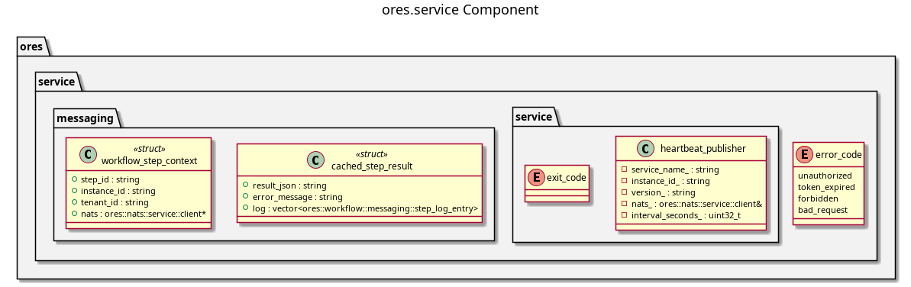

:PROPERTIES:
:ID: 9CFAC175-C28F-4C03-9655-1CDC6E8C3EE0
:END:
#+title: ores.service
#+description: NATS domain service runner infrastructure — domain service lifecycle, heartbeat publishing, and handler helpers.
#+type: ores.codegen.component
#+level: cross
#+filetags: :service:infrastructure:component:
#+created: 2026-05-20
#+updated: 2026-05-20
#+name: service
#+full_name: ores.service
#+brief: Common infrastructure shared by all domain microservices

* Diagram

#+attr_html: :width 100% :alt ores.service component diagram
#+caption: ores.service

* Summary

=ores.service= provides the shared NATS domain service runner infrastructure
used by every ORE Studio backend service. It supplies =domain_service_runner=
(NATS queue-subscribe lifecycle), =signing_service_runner= (variant for
signing-required services), =wt_service_runner= (for the Wt web frontend),
=heartbeat_publisher= (regular NATS heartbeats for health monitoring), and
=request_context= with handler helpers for processing inbound NATS messages.
All =*.service= entrypoints build on these runners rather than wiring NATS
directly.

* Inputs

- NATS connection and subject prefix from service configuration.
- Registered handler functions from the domain's =*.core= library.

* Outputs

- A running NATS queue-subscribe loop that routes messages to handlers.
- Periodic heartbeat messages published on a configured subject.

* Entry points

- =include/ores.service/service/domain_service_runner.hpp= — NATS service runner.
- =include/ores.service/service/heartbeat_publisher.hpp= — health heartbeats.
- =include/ores.service/service/request_context.hpp= — per-request context.
- =include/ores.service/messaging/handler_helpers.hpp= — message dispatch helpers.

* Dependencies

- =ores.nats= — NATS transport.
- =ores.logging= — structured logging.

* See also

-
