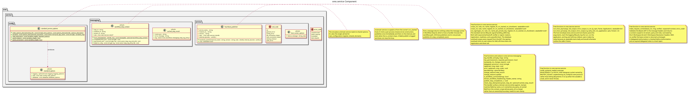

:PROPERTIES:
:ID: 9CFAC175-C28F-4C03-9655-1CDC6E8C3EE0
:END:
#+title: ores.service
#+description: NATS service infrastructure — the service lifecycle, the host envelope, per-request JWT contexts, heartbeat publishing, and the handler helpers every domain service writes against.
#+type: ores.codegen.component
#+level: cross
#+filetags: :service:infrastructure:component:
#+created: 2026-05-20
#+updated: 2026-09-26
#+name: service
#+full_name: ores.service
#+brief: Common infrastructure shared by all domain microservices

* Diagram

#+attr_html: :width 100% :alt ores.service component diagram
#+caption: ores.service

* Summary

=ores.service= is the shared infrastructure every ORE Studio NATS
backend service is built on. It owns no domain type and no wire type of
its own. What it owns is the envelope around them: the service lifecycle
that fetches the JWKS key with backoff, builds a JWT verifier, registers
the handlers and drains on shutdown; the host envelope that parses the
arguments, starts the logging lifecycle and runs the application; the
per-request database context built from the validated JWT; and the
handler helpers that stamp server-authoritative fields, check
permissions, reply and decode.

The component is model-free. It carries no entity, junction or operation
model, so nothing in it is generated, it appears in no SQL or shell
output, and every file is hand-written.

The two runners are the reason the component exists. Before them, each
service carried its own copy of the same fifty-line host body and the
same startup sequence, and two of them had silently drifted from the
canonical shape. A service now writes only its own registration call and
its own domain logic. Every =.service= binary and the tools that share
the host envelope (=ores.shell=, =ores.http.server=,
=ores.compute.wrapper=) are callers.

The component is protocol-adjacent rather than protocol-owning. It reads
the workflow step command headers that =ores.workflow= declares, and it
publishes the workflow and telemetry messages those components model, but
it declares no subject and produces no protocol header of its own.

* Facets

- =config/= — =standard_service_options=, the one place a domain service
  builds and parses the shared common/logging/database/NATS option set,
  and =standard_options=, the struct it reads them into. It is also the
  single call site for
  =nats_configuration::register_shared_domain()=.
- =messaging/= — the handler surface. =handler_helpers.hpp= holds
  =stamp=, =has_permission=, =reply=, =error_reply=, =decode= and
  =log_handler_entry=; =workflow_helpers.hpp= holds the workflow step
  context, the step idempotency check and the step-completion publishers.
- =service/= — the lifecycle itself: =run= for a database-backed service,
  =run_signing= for a service that mints its own tokens, =run_host_async=
  and =run_host_sync= for the process envelope, =make_request_context= for
  the JWT-to-context step, =heartbeat_publisher= for liveness,
  =notify_systemd_ready= for the readiness notification, and =exit_code=
  for the process exit contract.

* Inputs

- A connected NATS client and a database context per service.
- The JWKS public key fetched from IAM, or the service's own RSA private
  key for the signing lifecycle.
- Inbound NATS messages: their subject, headers and payload bytes.
- The process environment: =NOTIFY_SOCKET= for the readiness
  notification, and the option environment variables the parser reads.
- Command-line arguments and the parsed options of the calling tool.

* Outputs

- A registered, ready and gracefully draining NATS service, with the
  subscription count logged.
- A per-request =ores::database::context= scoped to the JWT's tenant,
  party, roles and workspace.
- A =READY=1= notification to systemd where =NOTIFY_SOCKET= is set.
- Heartbeat messages on the telemetry service's subject.
- Step-completion events on the workflow engine's subject.
- A process exit status drawn from =exit_code=.

* Entry points

- =include/ores.service/service/domain_service_runner.hpp= — =run=, the
  database-backed service lifecycle.
- =include/ores.service/service/signing_service_runner.hpp= —
  =run_signing=, the IAM variant that signs rather than verifies.
- =include/ores.service/service/host_runner.hpp= — =run_host_async=,
  =run_host_sync= and =host_runner_options=.
- =include/ores.service/service/request_context.hpp= —
  =make_request_context=.
- =include/ores.service/service/heartbeat_publisher.hpp= — the liveness
  publisher.
- =include/ores.service/service/systemd_notify.hpp= —
  =notify_systemd_ready=.
- =include/ores.service/service/exit_codes.hpp= — =exit_code=.
- =include/ores.service/config/standard_service_options.hpp= — the shared
  option set.
- =include/ores.service/messaging/handler_helpers.hpp= — the handler
  helpers.
- =include/ores.service/messaging/workflow_helpers.hpp= — the workflow
  step helpers.
- =include/ores.service/ores.service.hpp= — the namespace documentation
  header.

* Dependencies

- =ores.nats= — the client, the wire codec, the message type, the JWKS
  fetch and the standard header names.
- =ores.security= — JWT verification and signing.
- =ores.database= — the per-request context type.
- =ores.workflow.api= — the step-completion event, the step query
  protocol and the header names its step commands carry.
- =ores.telemetry.core= — the logging lifecycle manager the host envelope
  starts.
- =ores.platform= — the shutdown-signal set and the environment access
  the readiness notification reads.
- =ores.logging= — the logger every helper in the component writes to.
- =ores.utility= — tenant ids, the program-options helpers and the
  streaming operators the host envelope logs with.

* See also

- [[id:45CAC01F-BC56-4600-B206-EEE7545AE3AB][Component Architecture Audit]] -- the structural checklist this component was worked through.
- [[id:7B477025-132E-4B20-80B4-D8C9420880B8][Component Clean Standard]] -- the item-by-item standard this component now meets.
- [[id:C650CBC9-FDED-4C68-981F-7902E296928E][NATS entity protocol specification]] -- the protocol this component's helpers serve and the headers it reads.
- [[id:C9C24C99-F16C-45BE-A262-1C0F4502765E][ores.nats]] -- the transport, the wire codec and the JWKS fetch.
- [[id:D7BCB9B1-43C9-4DEF-8B1D-BABD23494DC2][ores.security]] -- JWT verification and signing.
- [[id:3A8F2E91-D4C7-8AB4-5E23-91D6F8C04A72][ores.database]] -- the request context this component builds.
- [[id:85319483-4AE9-4162-91F7-D72A8201134B][ores.workflow.api]] -- the step protocol whose headers and events the helpers use.
- [[id:271F40DA-D0EA-4D08-A4F8-3D2B835DF5E7][PlantUML class diagram conventions]] -- the rules the component diagram follows.
- [[id:FB797194-EB03-4837-B12D-E651DD5F16F2][Unit test conventions]] -- the Catch2 conventions the component's tests follow.
- [[id:0FB2EA84-EBB8-45C8-A8C8-F5815431C2D2][Code Review Checklist]] -- the naming and component-only checks this component passes.
