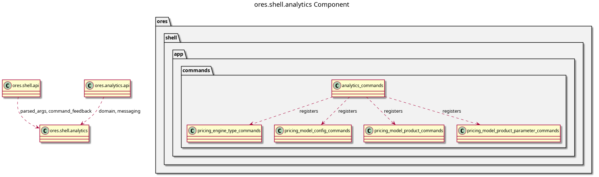

:PROPERTIES:
:ID: 64A0AF51-BCC8-47BE-9E90-29DB40850575
:END:
#+title: ores.shell.analytics
#+description: The shell's analytics adapter part. Holds the command units that project the analytics domain onto the REPL menu.
#+type: ores.codegen.component
#+component_kind: adapter
#+level: cross
#+filetags: :shell:repl:analytics:component:
#+created: 2026-09-23
#+updated: 2026-09-23
#+name: shell.analytics
#+full_name: ores.shell.analytics
#+brief: Shell analytics command units

* Diagram

#+attr_html: :width 100% :alt ores.shell.analytics component diagram
#+caption: ores.shell.analytics

* Summary

=ores.shell.analytics= is the adapter part that projects the analytics domain
onto the shell's REPL menu. It holds the generated command units for the
analytics models that opt in, and each unit owns one submenu. Four units land
here: =pricing_engine_type_commands=, =pricing_model_config_commands=,
=pricing_model_product_commands= and =pricing_model_product_parameter_commands=.

Analytics' models opt in through the profiles they bind, because both profiles
these four models carry enable the facet: =pricing_engine_type= binds
=simple-lookup=, and the three =pricing_model_*= models bind
=uuid-identified-lookup=. Each opted-in model also takes the literate recipe
the =ores.doc.shell-recipe= facet writes beside its unit.

The part declares =#+component_kind: adapter=. Its =CMakeLists.txt= files are
hand-authored, because the link libraries belong to the shell surface rather
than to the domain, and codegen writes only the two =component_files.cmake=
lists. A regeneration therefore never writes over the build.

The units are output of the =ores.cpp.shell-command= facet, which is opt-in per
model through the profile the model binds. The facet writes here because the
part is named after the domain the units project, which is the fractal naming
rule in [[id:F27E5DF7-6223-4B6F-80A5-CEFBEB1BC756][Component architecture]].

* Inputs

- Free-form token vectors from the command layer, parsed by =parse_args=.
- The logged-in NATS session, passed by reference into every helper.
- The analytics models under =projects/ores.analytics/modeling/= whose bound
  profiles opt in to the =ores.cpp.shell-command= facet.

* Outputs

- One command unit per opted-in model, at
  =src/app/commands/analytics/<unit>_commands.cpp= and
  =include/ores.shell/app/commands/analytics/<unit>_commands.hpp=.
- One literate recipe per unit, under =doc/recipes/shell/=, whose scripts
  tangle into =projects/ores.shell/scripts/library/=.
- NATS request messages to the analytics service, one per command.
- Formatted text output of query results to stdout.

* Entry points

- =include/ores.shell/app/commands/analytics/= -- the generated unit headers.
- =src/app/commands/analytics/= -- the generated unit implementations.
- =analytics_commands= -- the component-level entry the host calls once to
  install every unit below the analytics root menu.

* Dependencies

- =ores.shell.api= -- argument parsing, feedback, token conversion, request
  helpers.
- =ores.nats= -- NATS transport for service calls.
- =ores.analytics.api= -- the domain types and protocol messages the units send.
- =ores.utility= -- the rfl reflectors a response is printed with.
- =ores.platform= -- the date and time formatting a recipe reads back.
- =ores.logging= -- logger factory.
- =cli= -- the menu and handler types the units register against.

* See also

- [[id:D4E6E417-7D34-44B1-A373-73A1C9183137][ores.analytics]] -- the domain component the units project.
- [[id:D0876A24-69BA-F484-ED9B-71CD3AA8710C][ores.shell]] -- the composite this part belongs to.
- [[id:410D3332-BEED-4B51-B46C-01E92FB5E4F9][ores.shell.iam]] -- the sibling adapter part.
- [[id:9533D9D5-2928-4DC3-A39B-B48155B855EA][ores.shell.api]] -- the shared shell plumbing.
- [[id:35C549C4-A6C0-4037-84DF-63E677C8C61E][ores.shell.application]] -- the runnable host.
- [[id:D7287835-B101-4829-8B93-5C7F4FC9BA70][ores.cpp.shell-command]] -- the facet that emits the units.
- [[id:F27E5DF7-6223-4B6F-80A5-CEFBEB1BC756][Component architecture]] -- the composite and adapter kinds.
