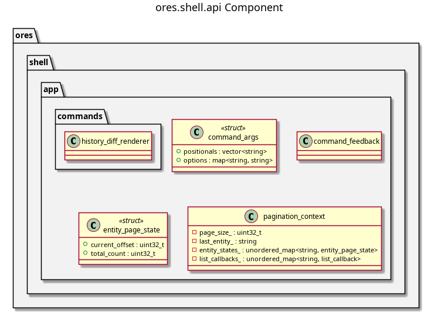

:PROPERTIES:
:ID: 9533D9D5-2928-4DC3-A39B-B48155B855EA
:END:
#+title: ores.shell.api
#+description: Shared shell plumbing — argument parsing, feedback stream state, pagination state, and the request helpers every command unit calls.
#+type: ores.codegen.component
#+component_kind: adapter
#+level: cross
#+filetags: :shell:repl:api:component:
#+created: 2026-09-16
#+updated: 2026-09-16
#+name: shell.api
#+full_name: ores.shell.api
#+brief: Shared shell command plumbing

* Diagram

#+attr_html: :width 100% :alt ores.shell.api component diagram
#+caption: ores.shell.api

* Summary

=ores.shell.api= holds the parts of the shell that every command unit uses and
that depend on no other part of the shell. A command unit parses its tokens
with =command_args=, writes errors through =command_feedback=, tracks paging
through =pagination_context=, and issues its NATS call through the
=do_auth_request= helper in =request_helpers.hpp=. The part also carries
=history_diff_renderer=, which renders the version-diff output shared by the
history verbs.

The part links =ores.nats= and =ores.history.api= and nothing above them. It
does not link =ores.shell.application=, so a new adapter part can depend on the
shell plumbing without pulling in the REPL host.

* Inputs

- Free-form token vectors from the command layer, parsed by =parse_args=.
- The logged-in NATS session, passed by reference into every helper.
- Pagination state the caller owns and threads through a request.

* Outputs

- =command_args= — the parsed positional and option token set.
- =command_feedback= — the stream state that marks a message as an error.
- =pagination_context= — per-entity page offset, total count, and list callbacks.
- =do_auth_request= — one typed authenticated request/response round trip.
- =history_diff_renderer= — formatted version-history output.

* Entry points

- =include/ores.shell/app/command_args.hpp= — token parsing.
- =include/ores.shell/app/command_feedback.hpp= — error stream marker.
- =include/ores.shell/app/pagination_context.hpp= — paging state.
- =include/ores.shell/app/request_helpers.hpp= — authenticated request helper.
- =include/ores.shell/app/commands/history_diff_renderer.hpp= — history rendering.

* Dependencies

- =ores.nats= — NATS transport and the request/timeout helpers.
- =ores.history.api= — history protocol types for the diff renderer.
- =ores.logging= — logger factory.
- =cli= — the menu and handler types the command layer registers against.

* See also

- [[id:D0876A24-69BA-F484-ED9B-71CD3AA8710C][ores.shell]] — the composite this part belongs to.
- [[id:2E53EE1A-6856-6904-7FEB-AC95C6722A63][Shell recipes]] — the how-to recipes for ores-shell usage, and the
  single source of truth for the generated =.ores= script library
  (=projects/ores.shell/scripts/library/=).
