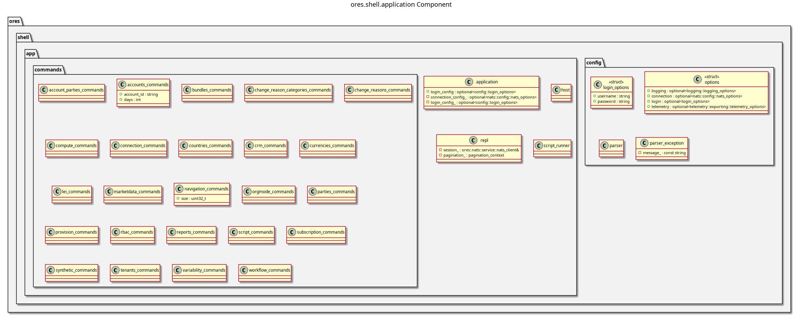

:PROPERTIES:
:ID: 35C549C4-A6C0-4037-84DF-63E677C8C61E
:END:
#+title: ores.shell.application
#+name: shell.application
#+full_name: ores.shell.application
#+description: The shell host — process entry point, config parsing, REPL loop, script runner, and the command units that register against the menu.
#+type: ores.codegen.component
#+level: cross
#+filetags: :shell:repl:application:component:
#+created: 2026-09-16
#+updated: 2026-09-16

* Diagram

#+attr_html: :width 100% :alt ores.shell.application component diagram
#+caption: ores.shell.application

* Summary

=ores.shell.application= is the runnable part of the shell. It owns the process
entry point, the Boost.ProgramOptions parser and the options struct it fills,
the =host= that builds the REPL session, the =repl= loop, and the
=script_runner= that replays a =.ores= script. It also holds the command units
that register the shell's menus, and builds =ores.shell.exe=.

The command units are grouped by the domain they project. Each unit names the
domain it belongs to, and a later wave moves it into its own
=ores.shell.<domain>= part. Until then they all live here.

* Inputs

- CLI arguments: server URL, username, password, auto-login flag.
- Config file with connection and credential defaults.
- Interactive REPL commands typed at the prompt, or a =.ores= script file.
- Domain protocol types from every linked =ores.<domain>.api= library.

* Outputs

- NATS request messages to domain services.
- Formatted text output of query results to stdout.
- =ores.shell.exe= — the shell executable.

* Entry points

- =src/main.cpp= — process entry point.
- =src/config/= — CLI argument parsing and configuration loading.
- =src/app/host.cpp= — session and menu wiring.
- =src/app/repl.cpp= — the REPL loop.
- =src/app/script_runner.cpp= — non-interactive script replay.
- =src/app/commands/= — one unit per domain menu.

* Dependencies

- =ores.shell.api= — argument parsing, feedback, pagination, request helpers.
- =ores.nats= — NATS transport for service calls.
- =ores.iam.api=, =ores.refdata.api=, =ores.trading.api=, and the remaining
  =ores.<domain>.api= libraries — NATS protocol types for the command units.
- Boost.ProgramOptions — CLI argument parsing.

* See also

- [[id:D0876A24-69BA-F484-ED9B-71CD3AA8710C][ores.shell]] — the composite this part belongs to.
- [[id:2E53EE1A-6856-6904-7FEB-AC95C6722A63][Shell recipes]] — the how-to recipes for ores-shell usage, and the
  single source of truth for the generated =.ores= script library
  (=projects/ores.shell/scripts/library/=).
