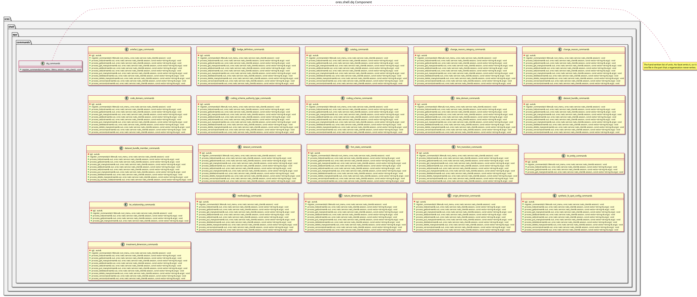

:PROPERTIES:
:ID: 3B0D02D1-5A98-4897-B23A-D668CCC236BC
:END:
#+title: ores.shell.dq
#+description: The shell's dq adapter part. Holds the generated command units that project the dq domain onto the REPL menu.
#+type: ores.codegen.component
#+component_kind: adapter
#+level: cross
#+filetags: :shell:repl:dq:component:
#+created: 2026-09-26
#+updated: 2026-09-26
#+name: shell.dq
#+full_name: ores.shell.dq
#+brief: Shell dq command units

* Diagram

#+attr_html: :width 100% :alt ores.shell.dq component diagram
#+caption: ores.shell.dq

* Summary

=ores.shell.dq= is the adapter part that projects the dq domain onto the shell's
REPL menu. It holds the generated command units for the dq models that opt in,
and each unit owns one submenu.

The units talk to the dq service over the bus, so they include the dq protocol
headers and not the core library. That is the whole reason the part exists: the
entity models were on the canonical protocol stack while their shell units were
compiled by nothing, so the commands a reader found in the recipes reached no
build.

The part declares =#+component_kind: adapter=, so its =CMakeLists.txt= files are
hand-authored and codegen writes only the two =component_files.cmake= lists.

* Inputs

- The dq models that opt in to the shell facets, through the profiles they bind.
- The live session the REPL holds.

* Outputs

- One submenu per entity, registered by the =dq_commands= aggregator.

* Entry points

- =include/ores.shell/app/commands/dq/= — one generated command header per
  entity.
- =src/app/commands/dq/= — the generated units, and the =dq= submenus they own.
- =ores.shell.application='s =dq_commands= aggregator — the hand-written list at
  =include/ores.shell/app/commands/dq/dq_commands.hpp= that the REPL calls.

* Dependencies

- [[id:AAF28605-81BE-4B7F-9B6E-7B9B1D99D7C3][ores.dq]] — the domain the units
  project, through its protocol headers.
- [[id:D0876A24-69BA-F484-ED9B-71CD3AA8710C][ores.shell]] — the shell the part is
  linked into.

* See also

- [[id:0AB97FD9-D248-46FE-9E14-E7F772637A51][ores.shell.refdata]] — the same shape
  for another domain.
