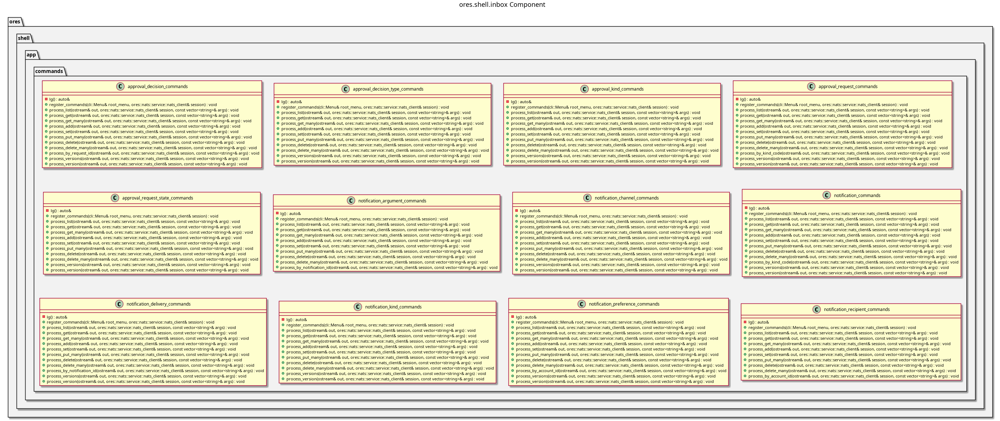

:PROPERTIES:
:ID: E9943AF3-6CA1-4DB8-B4A0-28EB62CD54B9
:END:
#+title: ores.shell.inbox
#+description: The shell's inbox adapter part: the generated command units that project the approval and notification entities' verbs onto the REPL.
#+type: ores.codegen.component
#+component_kind: adapter
#+level: cross
#+filetags: :shell:repl:inbox:component:
#+created: 2026-10-04
#+updated: 2026-10-04
#+name: shell.inbox
#+full_name: ores.shell.inbox
#+brief: Shell inbox command units

* Diagram

#+attr_html: :width 100% :alt ores.shell.inbox component diagram
#+caption: ores.shell.inbox

* Summary

=ores.shell.inbox= is the adapter part that projects the inbox domain onto the
shell's REPL menu. It holds one generated command unit per inbox entity: the
approval kinds, request states, decision types, requests and decisions, and the
notification kinds, channels, notifications, arguments, recipients, deliveries
and preferences. The delivery outcomes are a closed, read-only set and have no
unit. Each unit owns one submenu below the root and answers that entity's verbs
by sending the generated protocol messages to the inbox service. The part declares
=#+component_kind: adapter=, and its =CMakeLists.txt= files are hand-authored
because the link libraries belong to the shell surface rather than to the
domain.

* Inputs

- Free-form token vectors from the command layer, parsed by =parse_args=.
- The logged-in NATS session, passed by reference into every helper.
- The inbox entity models under =projects/ores.inbox/modeling/=.

* Outputs

- One command unit per entity, under =src/app/commands/inbox/= and
  =include/ores.shell/app/commands/inbox/=.
- NATS request messages to the inbox service, one per command.
- Formatted text output of query results to stdout.

* Entry points

- =include/ores.shell/app/commands/inbox/= -- the generated unit headers.
- =src/app/commands/inbox/= -- the unit implementations.
- =ores.shell.application='s =repl.cpp= -- calls each unit's =register_commands=
  once to install its submenu. It lives in the application part, not here.
- =tests/= -- the units' registration tests, plus the Catch2 =main=.

* Dependencies

- =ores.shell.api= -- argument parsing, feedback and request helpers.
- =ores.nats= -- NATS transport for service calls.
- =ores.inbox.api= -- the domain types and protocol messages the units send.
- =ores.utility= -- the rfl reflectors a response is printed with.
- =ores.logging= -- logger factory.
- =cli= -- the menu and handler types the units register against.

* See also

- [[id:D0876A24-69BA-F484-ED9B-71CD3AA8710C][ores.shell]] -- the composite this part belongs to.
- [[id:9533D9D5-2928-4DC3-A39B-B48155B855EA][ores.shell.api]] -- the shared shell plumbing.
- [[id:35C549C4-A6C0-4037-84DF-63E677C8C61E][ores.shell.application]] -- the runnable host.
- [[id:EE61043C-CBCE-44B5-85E9-A3E433FBA3EF][ores.inbox]] -- the composite whose domain the units project.
- [[id:D7287835-B101-4829-8B93-5C7F4FC9BA70][ores.cpp.shell-command]] -- the facet that emits the units.
- [[id:F27E5DF7-6223-4B6F-80A5-CEFBEB1BC756][Component architecture]] -- the composite and adapter kinds.
