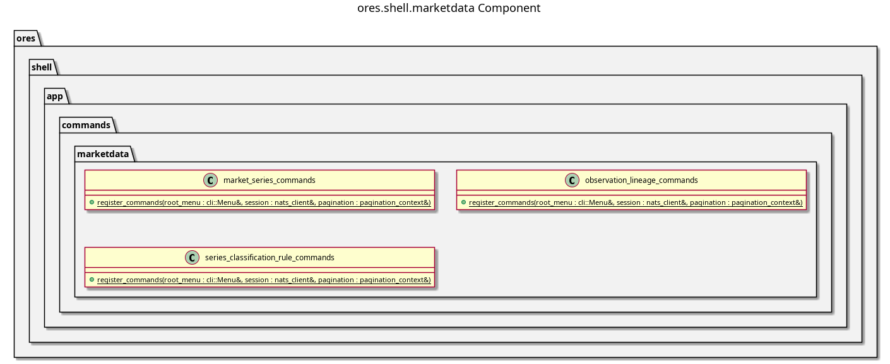

:PROPERTIES:
:ID: C4C3CBF2-92CC-4E8A-808E-78BA430544E0
:END:
#+title: ores.shell.marketdata
#+description: The shell's marketdata adapter part. Holds the generated command units that project the market-data domain onto the REPL menu.
#+type: ores.codegen.component
#+component_kind: adapter
#+level: cross
#+filetags: :shell:repl:marketdata:component:
#+created: 2026-09-27
#+updated: 2026-09-27
#+name: shell.marketdata
#+full_name: ores.shell.marketdata
#+brief: Shell marketdata command units

* Summary

=ores.shell.marketdata= is an adapter part: it holds no domain logic and
owns no table. Each unit projects one market-data entity onto the REPL by
issuing the canonical NATS requests =ores.marketdata= already answers and
rendering the reply as a table. The units are generated from the
market-data models, so the commands a user can type and the operations the
service offers cannot drift apart.

* Diagram

#+attr_html: :width 100% :alt ores.shell.marketdata component diagram
#+caption: ores.shell.marketdata

* Inputs

- A logged-in session's authenticated NATS connection.

* Outputs

- Command units: =market_series_commands=, =observation_lineage_commands=
  and =series_classification_rule_commands=.

* Entry points

- =include/ores.shell/app/commands/marketdata/=.

* Dependencies

- =ores.shell.api= for the command framework and request helpers.
- =ores.marketdata.api= for the protocol types the units speak.

* See also

- [[id:F2FA516C-1F86-43EF-80D4-E92F640B6CFD][ores.marketdata]] — the component these commands reach.
