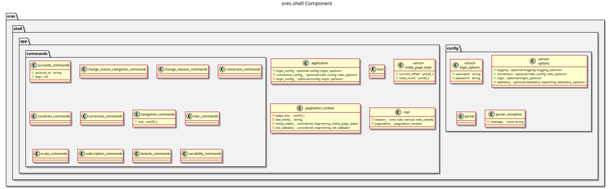

:PROPERTIES:
:ID: D0876A24-69BA-F484-ED9B-71CD3AA8710C
:END:
#+title: ores.shell
#+name: shell
#+full_name: ores.shell
#+description: Interactive REPL for connecting to ORE Studio via NATS — currency queries, account management, and auto-login.
#+type: ores.codegen.component
#+level: cross
#+filetags: :shell:repl:tool:component:
#+created: 2026-05-20
#+updated: 2026-05-20

* Diagram

#+attr_html: :width 100% :alt ores.shell component diagram
#+caption: ores.shell

* Summary

=ores.shell= is an interactive REPL for connecting to ORE Studio via NATS. It
supports command-line argument parsing (via Boost.ProgramOptions), auto-connect
and auto-login from a configuration file, and commands for querying currencies,
managing accounts (create, list, login, unlock), and checking session state.
It is primarily a developer and operations tool for inspecting live services
without a full desktop client.

* Inputs

- CLI arguments: server URL, username, password, auto-login flag.
- Config file with connection and credential defaults.
- Interactive REPL commands typed at the prompt.

* Outputs

- NATS request messages to domain services.
- Formatted text output of query results to stdout.

* Entry points

- =src/main.cpp= — process entry point.
- =src/config/= — CLI argument parsing and configuration loading.
- =src/app/= — REPL loop and command dispatch.

* Dependencies

- =ores.nats= — NATS transport for service calls.
- =ores.iam.api=, =ores.refdata.api= — NATS protocol types.
- Boost.ProgramOptions — CLI argument parsing.

* See also

- [[id:2E53EE1A-6856-6904-7FEB-AC95C6722A63][Shell recipes]] — the how-to recipes for ores-shell usage, and the
  single source of truth for the generated =.ores= script library
  (=projects/ores.shell/scripts/library/=).
