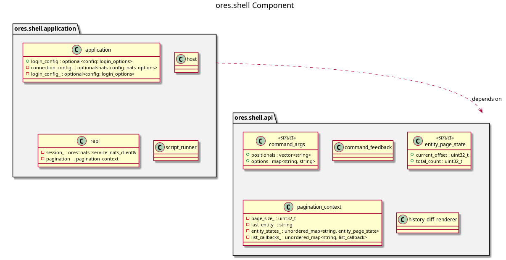

:PROPERTIES:
:ID: D0876A24-69BA-F484-ED9B-71CD3AA8710C
:END:
#+title: ores.shell
#+name: shell
#+full_name: ores.shell
#+description: Interactive REPL for connecting to ORE Studio via NATS — currency queries, account management, and auto-login.
#+type: ores.codegen.component
#+component_kind: composite
#+parts: api trading iam refdata analytics application modeling
#+level: cross
#+filetags: :shell:repl:tool:component:
#+created: 2026-05-20
#+updated: 2026-09-16

* Diagram

#+attr_html: :width 100% :alt ores.shell component diagram
#+caption: ores.shell

* Summary

=ores.shell= is an interactive REPL for connecting to ORE Studio via NATS. It
supports command-line argument parsing (via Boost.ProgramOptions), auto-connect
and auto-login from a configuration file, and commands for querying currencies,
managing accounts (create, list, login, unlock), and checking session state.
It is primarily a developer and operations tool for inspecting live services
without a full desktop client.

=ores.shell= is a composite component. It holds no code of its own; the parent
directory adds its parts. The parts are:

| Part | Role |
|------|------|
| =api= | Shared shell plumbing: argument parsing, feedback, pagination, request helpers, history rendering. Links =ores.nats= and =ores.history.api= only. |
| =application= | The runnable host: process entry point, config parsing, REPL loop, script runner, and the command units. Builds =ores.shell.exe=. |
| =modeling= | Component documentation and the PlantUML diagram target. Not a compilable library. |

The =api= / =application= split is what lets a domain adapter part link the
shell plumbing without pulling in the REPL host. Each command unit names the
domain it projects, and a later wave moves it into its own
=ores.shell.<domain>= part, following the fractal naming rule in
[[id:F27E5DF7-6223-4B6F-80A5-CEFBEB1BC756][Component architecture]].

* Inputs

- CLI arguments: server URL, username, password, auto-login flag.
- Config file with connection and credential defaults.
- Interactive REPL commands typed at the prompt.

* Outputs

- NATS request messages to domain services.
- Formatted text output of query results to stdout.
- =ores.shell.exe= — the shell executable.

* Entry points

- =application/src/main.cpp= — process entry point.
- =application/src/config/= — CLI argument parsing and configuration loading.
- =application/src/app/= — REPL loop and command dispatch.
- =api/include/ores.shell/app/= — the plumbing every command unit uses.

* Dependencies

- =ores.nats= — NATS transport for service calls.
- =ores.iam.api=, =ores.refdata.api=, =ores.trading.api=, and the remaining
  =ores.<domain>.api= libraries — NATS protocol types.
- Boost.ProgramOptions — CLI argument parsing.

* See also

- [[id:9533D9D5-2928-4DC3-A39B-B48155B855EA][ores.shell.api]] — the shared shell plumbing part.
- [[id:35C549C4-A6C0-4037-84DF-63E677C8C61E][ores.shell.application]] — the runnable host part.
- [[id:2E53EE1A-6856-6904-7FEB-AC95C6722A63][Shell recipes]] — the how-to recipes for ores-shell usage, and the
  single source of truth for the generated =.ores= script library
  (=projects/ores.shell/scripts/library/=).

* Audit record

The recurring [[id:45CAC01F-BC56-4600-B206-EEE7545AE3AB][component architecture
audit]] ran on 2026-09-16, against the composite as split into =api= and
=application=. The triage of each finding is below.

- *Fixed.* Five end-of-line comments in the =application= sources moved above
  their statements. The System Model application page described =ores.shell= as
  POSIX and Emacs Lisp developer tooling, and linked that description to this
  component's id. It now describes the REPL and lists both parts. A prose
  reference to =ores.shell/host.cpp= in =ores.service= now gives the path the
  file actually has.
- *Recorded.* Part include prefixes. The signed-off folder catalogue nests
  public headers as =include/ores.<full-name>/=, and the domain composites
  follow it. This component uses =include/ores.shell/= in both parts, so the
  adapter convention is real but unwritten. Converging on the full name
  touches 153 files here, so it waits on a decision. Write the adapter
  exception into the catalogue, or converge the adapters on the full
  name.
- *Recorded.* =scripts/= sits at the component root, but =application= consumes
  it and owns both the install rule and the tangle that fills it. The
  signed-off catalogue does not carry the name. Either move the tree under
  =application=, or sign the folder off.
- *Recorded.* The command units hold every complexity warning. They are the
  code the next wave replaces with generated units, so refactoring them by hand
  now would be thrown away.
- *Pass.* Both part suites ran green against the split, and nothing else in
  the tree regressed with them. =ctest --preset linux-clang-debug-make=
  reports 100% tests passed, 0 failed out of 72; =ores.shell.api.tests= took
  17.9 s and =ores.shell.application.tests= 11.3 s. The gcc tree cannot run
  this check in this worktree. The build slice sets =memory.high= to 8 GiB,
  and one gcc command unit held 6.76 GiB RSS on its own, so the kernel
  throttles the compiler into uninterruptible sleep before the suites can be
  built there. The clang tree stays under the same cap, which is why the run
  used that preset.
- *Comments.* Pass, after the five fixes above. =} // namespace= appears 46
  times here and 1555 files repository-wide, so it counts as convention rather
  than a finding.
- *Complexity measure.* 21702 NLOC over 610 functions at an average CCN of 4.2.
  16 warnings, 15 of them in =application= command units and one in =api=
  (=render_history_diff=, CCN 16). The worst are =process_tenant= and
  =process_grid_stats= at CCN 34, then =process_add_bond_instrument= and
  =process_party= at 26. Warning rate 0.03 by function, 0.10 by NLOC.

** Review round

The local review of the split's change ran on 2026-09-16 over the whole diff,
not only this component. Three findings touch =ores.shell=, and all three are
now in the record.

- *Fixed.* The component was in no codegen registry. The codegen catalogue had
  no =shell= row, so =compass codegen regenerate --component shell= answered
  "Unknown component", and the drift gate's registry did not carry the name
  either. The generated root therefore had no regeneration path and no drift
  coverage. One catalogue row and one registry entry fix both. The gate now
  reports no drift for the component and for the whole registry, and the root
  regenerates byte-identical.
- *Fixed.* Both part test binaries set the log module name to =ores.shell.tests=,
  so the two suites could not be told apart in the logs. Each now names its own
  binary, =ores.shell.api.tests= and =ores.shell.application.tests=, which is
  the =ores.trading=, =ores.refdata= and =ores.iam= convention.
- *Recorded.* Generating the =api= part on its own rewrites its build files.
  Pointing =compass codegen generate= at =api/modeling/component_overview.org=
  at the =ores.cmake.component= address replaced =CMakeLists.txt=,
  =modeling/CMakeLists.txt=, =src/CMakeLists.txt= and =tests/CMakeLists.txt=
  with the flat scaffold, which drops the link libraries, the test environment
  command and the test reporter. The part model declares no
  =#+component_kind=, so the flat archetype set applies, and no archetype
  matches an adapter part. The four files were restored byte-identical, and the
  composite path the gate runs leaves the parts alone. The fix
  belongs to the command codegen wave, which is the first work that must write
  into a part on purpose.
