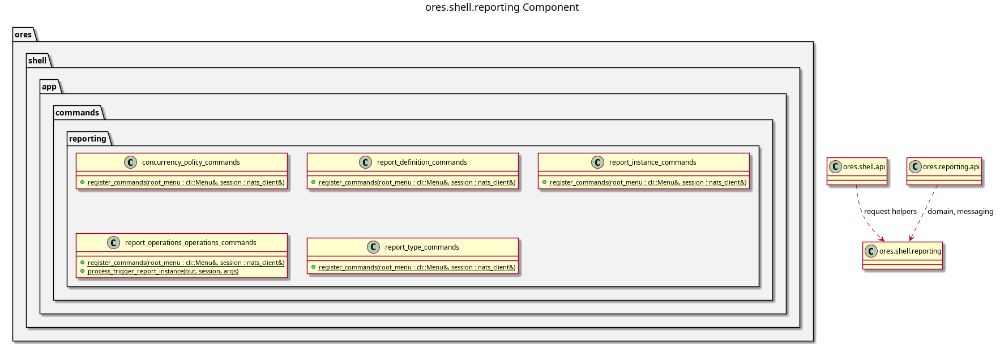

:PROPERTIES:
:ID: 72ea75f9-c63d-4a0d-a7e8-0d72473e22d6
:END:
#+title: ores.shell.reporting
#+description: The shell's reporting adapter part. Holds the generated command units that project the reporting domain onto the REPL menu.
#+type: ores.codegen.component
#+component_kind: adapter
#+level: cross
#+filetags: :shell:repl:reporting:component:
#+created: 2026-09-26
#+updated: 2026-09-26
#+name: reporting
#+full_name: ores.shell.reporting
#+brief: Shell reporting command units

* Summary

=ores.shell.reporting= is the adapter part that projects the reporting domain
onto the shell's REPL menu. It holds one generated command unit per reporting
model: the report definitions, the report instances, the report types, the
concurrency policies, and the component's domain operations.

The part declares =#+component_kind: adapter=. Its =CMakeLists.txt= files are
hand-authored, because the link libraries belong to the shell surface rather
than to the domain, and codegen writes only the two =component_files.cmake=
lists. A regeneration therefore never writes over the build.

The units are output of the =ores.cpp.shell-command= facet, which is opt-in per
model. The facet writes here because the part is named after the domain the
units project, which is the fractal naming rule in
[[id:F27E5DF7-6223-4B6F-80A5-CEFBEB1BC756][Component architecture]].

The operations unit carries =report_operations trigger-report-instance=, which
is the command that drives the report instance FSM. It is the only way to run a
report by hand, and a report scheduled by =ores.scheduler= reaches the same
subject.

* Inputs

- Free-form token vectors from the command layer, parsed by =parse_args=.
- The logged-in NATS session, passed by reference into every helper.
- The reporting models under =projects/ores.reporting/modeling/=, whose
  profiles opt in to the =ores.cpp.shell-command= facet.

* Outputs

- Five command units, under =src/app/commands/reporting/= and
  =include/ores.shell/app/commands/reporting/=.
- Literate recipes under =doc/recipes/shell/=, whose scripts tangle into
  =projects/ores.shell/scripts/library/=.
- NATS request messages to the reporting service, one per command.
- Formatted text output of query results to stdout.

* Entry points

- =include/ores.shell/app/commands/reporting/= -- the generated unit headers.
- =src/app/commands/reporting/= -- the generated unit implementations.
- =register_commands= on each unit -- what the host calls to install the
  submenu below the shell's root menu.

* Dependencies

- =ores.shell.api= -- the command layer: =parse_args=, =request_helpers= and the
  feedback helpers every unit uses.
- =ores.reporting.api= -- the domain types and the protocol messages the units
  send.

* See also

- [[id:32055CB5-7CA1-4204-8A8E-88DCAC7CB585][Clean ores.reporting to the component clean standard]] -- the work that
  generated this part.

* Diagram

