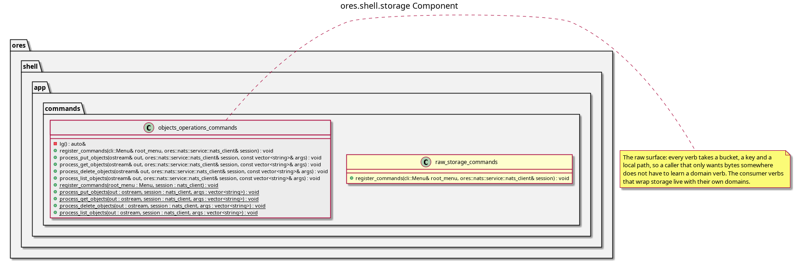

:PROPERTIES:
:ID: 6EE638CE-19BB-4858-94DB-0F371E1AC9C2
:END:
#+title: ores.shell.storage
#+description: The shell's storage adapter part. Holds the generated NATS command unit and the hand-written HTTP verb set that project object storage onto the REPL.
#+type: ores.codegen.component
#+component_kind: adapter
#+level: cross
#+filetags: :shell:repl:storage:component:
#+created: 2026-09-26
#+updated: 2026-09-27
#+name: storage
#+full_name: ores.shell.storage
#+brief: Shell raw storage command units

* Diagram

#+attr_html: :width 100% :alt ores.shell.storage component diagram
#+caption: ores.shell.storage

* Summary

=ores.shell.storage= is the adapter part that projects object storage onto the
shell's REPL. It holds two units, one per interface storage serves.

- =objects_operations_commands= is generated from
  [[id:D469834F-DB7C-4486-B43F-CBD984744C36][ores.storage.objects]]. It speaks
  the NATS interface, so one operation is one message and a value travels inside
  the message that names it.
- =raw_storage_commands= is hand-written, because no model declares a local path.
  It speaks the HTTP interface, so a verb is a bucket, a key and a local path,
  and the bytes move as a file.

Both units are raw: neither knows what a bucket means, and neither names a key.
The consumer verbs that wrap storage, such as the compute package publisher,
live with their own domains.

The two menus also keep both interfaces exercisable by hand, which is what the
interface story asked for: =objects= proves the NATS surface and =storage=
proves the HTTP one.

* Inputs

- The operation model the generated unit comes from.
- The live session, which supplies the bearer token every HTTP call carries.

* Outputs

- An =objects= submenu whose verbs reach the object operation set over NATS.
- A =storage= submenu: =put=, =get=, =delete= and =list=, over HTTP.

* Entry points

- =include/ores.shell/app/commands/storage/objects_operations_commands.hpp= —
  the generated =objects= submenu.
- =include/ores.shell/app/commands/storage/raw_storage_commands.hpp= — the
  =storage= submenu.
- =application='s =storage_commands= aggregator is the hand-written list that
  registers both.

* Dependencies

- [[id:8778E5E5-2123-4E40-A16D-B13B16D1B7AD][ores.storage.api]] — the modelled
  surface the generated unit speaks, and the URL contract both units address.
- =ores.storage.core= — the transfer helper the raw verbs move files with.
- =ores.shell.api= — the shared command helpers, including the HTTP base URL the
  shell resolves the storage server from.

* See also

- [[id:D0876A24-69BA-F484-ED9B-71CD3AA8710C][ores.shell]] — the component group overview.
- [[id:286B7167-9B8A-4937-BBA5-E9D285AFECE3][Object Storage]] — the target state, and the raw and wrapped use it separates.
