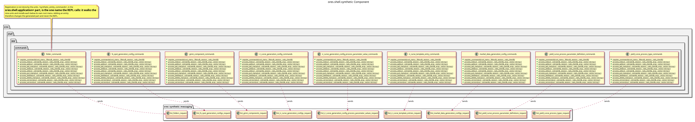

:PROPERTIES:
:ID: FA813322-33F8-4346-B784-CAF59A7EB13F
:END:
#+title: ores.shell.synthetic
#+description: The shell's synthetic adapter part. Holds the generated command units that project the synthetic domain onto the REPL menu.
#+type: ores.codegen.component
#+component_kind: adapter
#+level: cross
#+filetags: :shell:repl:synthetic:component:
#+created: 2026-09-26
#+updated: 2026-09-26
#+name: shell.synthetic
#+full_name: ores.shell.synthetic
#+brief: Shell synthetic command units

* Diagram

#+attr_html: :width 100% :alt ores.shell.synthetic component diagram
#+caption: ores.shell.synthetic

* Summary

=ores.shell.synthetic= is the adapter part that projects the synthetic
domain onto the shell's REPL menu. It holds the generated command units for
the synthetic entity models that opt in, one unit per entity, and each unit
owns one submenu below the root. A unit answers that entity's CRUD verbs --
=list=, =get=, =get-many=, =add=, =set=, =put-many=, =delete=,
=delete-many=, =versions= and =version= -- by sending the generated protocol
messages to the synthetic service. The verbs come from the entity's derived
protocol rather than from the table, so the surface moves when the model
moves and no verb is hand-written here. The part declares
=#+component_kind: adapter=, and its =CMakeLists.txt= files are hand-authored
because the link libraries belong to the shell surface rather than to the
domain.

* Inputs

- Free-form token vectors from the command layer, parsed by =parse_args=.
- The logged-in NATS session, passed by reference into every helper.
- The synthetic entity models under =projects/ores.synthetic/modeling/= whose
  properties drawer opts in to the =ores.cpp.shell-command= facet.

* Outputs

- One command unit per opted-in entity, at
  =src/app/commands/synthetic/<unit>_commands.cpp= and
  =include/ores.shell/app/commands/synthetic/<unit>_commands.hpp=.
- NATS request messages to the synthetic service, one per command.
- Formatted text output of query results to stdout.

* Entry points

- =include/ores.shell/app/commands/synthetic/= -- the generated unit headers,
  one per entity.
- =src/app/commands/synthetic/= -- the generated unit implementations.
- =ores.shell.application='s
  =synthetic_entity_commands::register_commands= -- the aggregator the REPL
  calls once to install every unit below the synthetic root menus. It lives
  in the application part, not here, and needs no edit when an entity is
  added.

* Dependencies

- =ores.shell.api= -- argument parsing, feedback, pagination and request
  helpers.
- =ores.nats= -- NATS transport for service calls.
- =ores.synthetic.api= -- the domain types and protocol messages the units
  send.
- =ores.utility= -- the rfl reflectors a response is printed with.
- =ores.logging= -- logger factory.
- =cli= -- the menu and handler types the units register against.

* See also

- [[id:D0876A24-69BA-F484-ED9B-71CD3AA8710C][ores.shell]] -- the composite this part belongs to.
- [[id:9533D9D5-2928-4DC3-A39B-B48155B855EA][ores.shell.api]] -- the shared shell plumbing.
- [[id:35C549C4-A6C0-4037-84DF-63E677C8C61E][ores.shell.application]] -- the runnable host.
- [[id:96AB808A-DF49-410F-8A90-D1065A3716AC][ores.synthetic]] -- the composite whose domain the units project.
- [[id:D7287835-B101-4829-8B93-5C7F4FC9BA70][ores.cpp.shell-command]] -- the facet that emits the units.
- [[id:F27E5DF7-6223-4B6F-80A5-CEFBEB1BC756][Component architecture]] -- the composite and adapter kinds.
