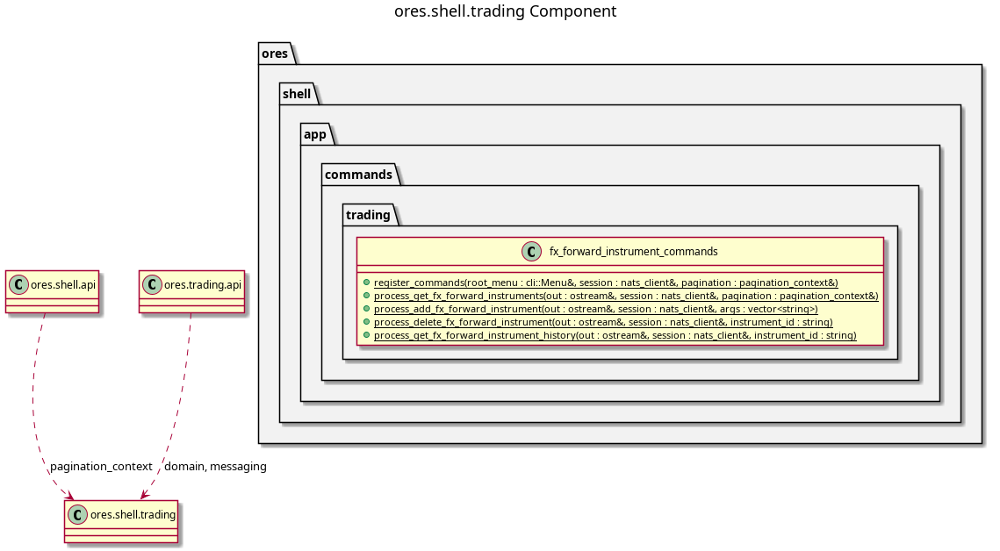

:PROPERTIES:
:ID: B0B23437-98B4-4A0E-A93A-C5C0A0DE504A
:END:
#+title: ores.shell.trading
#+description: The shell's trading adapter part. Holds the generated command units that project the trading domain onto the REPL menu.
#+type: ores.codegen.component
#+component_kind: adapter
#+level: cross
#+filetags: :shell:repl:trading:component:
#+created: 2026-09-16
#+updated: 2026-09-16
#+name: shell.trading
#+full_name: ores.shell.trading
#+brief: Shell trading command units

* Diagram

#+attr_html: :width 100% :alt ores.shell.trading component diagram
#+caption: ores.shell.trading

* Summary

=ores.shell.trading= is the adapter part that projects the trading domain
onto the shell's REPL menu. It holds the generated command units for the
trading entities that opt in, and each unit owns that entity's submenu with
its =get=, =add=, =delete= and =history= verbs.

The part declares =#+component_kind: adapter=. Its =CMakeLists.txt= files are
hand-authored, because the link libraries belong to the shell surface rather
than to the domain, and codegen writes only the two =component_files.cmake=
lists. A regeneration therefore never writes over the build.

The units are output of the =ores.cpp.shell-command= facet, which is opt-in
per entity through an =:ores.cpp.shell-command.enabled: true= entry in the
entity model's properties drawer. The facet writes here because the part is
named after the domain the units project, which is the fractal naming rule in
[[id:F27E5DF7-6223-4B6F-80A5-CEFBEB1BC756][Component architecture]].

The part lands in two steps. The first unit proves the facet writes here and
builds. The remaining units, the =register_trading_shell_commands= entry the
host calls, and the deletion of the hand-written units in =application= all
follow in the second step.

* Inputs

- Free-form token vectors from the command layer, parsed by =parse_args=.
- The logged-in NATS session, passed by reference into every helper.
- The entity models under =projects/ores.trading/modeling/= whose properties
  drawer opts in to the =ores.cpp.shell-command= facet.

* Outputs

- One command unit per opted-in trading entity, at
  =src/app/commands/trading/<entity>_commands.cpp= and
  =include/ores.shell/app/commands/trading/<entity>_commands.hpp=.
- NATS request messages to the trading service, one per CRUD verb.
- Formatted text output of query results to stdout.

* Entry points

- =include/ores.shell/app/commands/trading/= — the generated unit headers.
- =src/app/commands/trading/= — the generated unit implementations.
- =register_trading_shell_commands= — the component-level entry the host calls
  once to install every unit below the trading root menu. Not landed yet.

* Dependencies

- =ores.shell.api= — argument parsing, feedback, pagination, request helpers.
- =ores.nats= — NATS transport for service calls.
- =ores.trading.api= — the domain types and protocol messages the units send.
- =ores.logging= — logger factory.
- =cli= — the menu and handler types the units register against.

* See also

- [[id:D0876A24-69BA-F484-ED9B-71CD3AA8710C][ores.shell]] — the composite this part belongs to.
- [[id:9533D9D5-2928-4DC3-A39B-B48155B855EA][ores.shell.api]] — the shared shell plumbing.
- [[id:35C549C4-A6C0-4037-84DF-63E677C8C61E][ores.shell.application]] — the runnable host.
- [[id:D7287835-B101-4829-8B93-5C7F4FC9BA70][ores.cpp.shell-command]] — the facet that emits the units.
- [[id:F27E5DF7-6223-4B6F-80A5-CEFBEB1BC756][Component architecture]] — the composite and adapter kinds.
