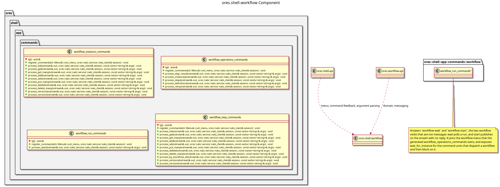

:PROPERTIES:
:ID: D6E19B12-A951-4A90-80E8-6F7B0063CA0E
:END:
#+title: ores.shell.workflow
#+description: The shell's workflow adapter part: generated command units for the workflow domain, plus the one blocking operation that no entity verb expresses.
#+type: ores.codegen.component
#+component_kind: adapter
#+level: cross
#+filetags: :shell:repl:workflow:component:
#+created: 2026-09-26
#+updated: 2026-09-26
#+name: shell.workflow
#+full_name: ores.shell.workflow
#+brief: Shell workflow command units

* Diagram

#+attr_html: :width 100% :alt ores.shell.workflow component diagram
#+caption: ores.shell.workflow

* Summary

=ores.shell.workflow= is the adapter part that projects the workflow domain
onto the shell's REPL menu. It holds the generated command units for the
=workflow_instance= and =workflow_step= models, one unit per entity, each
owning one submenu below the root and answering that entity's CRUD verbs by
sending the generated protocol messages to the workflow service. The verbs come
from the entity's derived protocol rather than from the table, so the surface
moves when the model moves. The part declares =#+component_kind: adapter=, and
its =CMakeLists.txt= files are hand-authored because the link libraries belong
to the shell surface rather than to the domain.

It also holds one hand-written unit, =workflow_operation_commands=, and the reason is
worth stating here rather than only in the code. The other components commission
workflows and then need to block until a run finishes: bundle publication, ORE
import and party provisioning each dispatch a workflow and wait on it, and a run
that declines to wait tells the operator to follow progress with =workflow
wait=. That verb is not an entity verb -- it polls the engine's step query until
the instance reaches a terminal state -- so generation has no unit for it and
none is a duplicate of it. It stays hand-written until an operation model
expresses the conversation, which is the workflow component's P04.

* Inputs

- Free-form token vectors from the command layer, parsed by =parse_args=.
- The logged-in NATS session, passed by reference into every helper.
- The workflow entity models under =projects/ores.workflow/modeling/= whose
  properties drawer opts in to the =ores.cpp.shell-command= facet.

* Outputs

- One command unit per opted-in entity, at
  =src/app/commands/workflow/<unit>_commands.cpp= and
  =include/ores.shell/app/commands/workflow/<unit>_commands.hpp=.
- NATS request messages to the workflow service, one per command.
- Formatted text output of query results to stdout, including the step-log
  entries a step recorded while it ran.

* Entry points

- =include/ores.shell/app/commands/workflow/= -- the generated unit headers, one
  per entity, plus the hand-written wait unit.
- =src/app/commands/workflow/= -- the unit implementations.
- =ores.shell.application='s =repl.cpp= -- calls =register_commands= once per
  unit to install the submenus. It lives in the application part, not here.
- =tests/= -- the per-unit registration tests, plus the Catch2 =main= every
  shell test module needs and only this one lacks by hand.

* Dependencies

- =ores.shell.api= -- argument parsing, feedback and request helpers.
- =ores.nats= -- NATS transport for service calls.
- =ores.workflow.api= -- the domain types and protocol messages the units send.
- =ores.platform= -- ISO 8601 instant parsing for token conversion.
- =ores.utility= -- the rfl reflectors a response is printed with.
- =ores.logging= -- logger factory.
- =cli= -- the menu and handler types the units register against.

* See also

- [[id:D0876A24-69BA-F484-ED9B-71CD3AA8710C][ores.shell]] -- the composite this part belongs to.
- [[id:9533D9D5-2928-4DC3-A39B-B48155B855EA][ores.shell.api]] -- the shared shell plumbing.
- [[id:35C549C4-A6C0-4037-84DF-63E677C8C61E][ores.shell.application]] -- the runnable host.
- [[id:7F4B91E2-3D86-4A57-B92C-08E146DA7359][ores.workflow]] -- the composite whose domain the units project.
- [[id:D7287835-B101-4829-8B93-5C7F4FC9BA70][ores.cpp.shell-command]] -- the facet that emits the units.
- [[id:F27E5DF7-6223-4B6F-80A5-CEFBEB1BC756][Component architecture]] -- the composite and adapter kinds.
