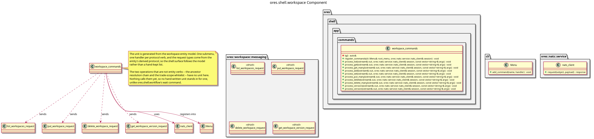

:PROPERTIES:
:ID: 50BDDED3-7E7D-445E-9A91-F1BDECEB82B1
:END:
#+title: ores.shell.workspace
#+description: The shell's workspace adapter part: the generated command unit that projects the workspace entity's verbs onto the REPL.
#+type: ores.codegen.component
#+component_kind: adapter
#+level: cross
#+filetags: :shell:repl:workspace:component:
#+created: 2026-09-28
#+updated: 2026-09-28
#+name: shell.workspace
#+full_name: ores.shell.workspace
#+brief: Shell workspace command units

* Diagram

#+attr_html: :width 100% :alt ores.shell.workspace component diagram
#+caption: ores.shell.workspace

* Summary

=ores.shell.workspace= is the adapter part that projects the workspace domain
onto the shell's REPL menu. It holds one generated command unit, for the
=workspace= entity, which owns one submenu below the root and answers that
entity's CRUD verbs by sending the generated protocol messages to the workspace
service. The verbs come from the entity's derived protocol rather than from the
table, so the surface moves when the model moves. The part declares
=#+component_kind: adapter=, and its =CMakeLists.txt= files are hand-authored
because the link libraries belong to the shell surface rather than to the
domain.

The two operations that are not entity verbs -- the ancestor resolution chain
and the trade-scope whitelist -- have no unit here. They are modelled as
operations rather than entity verbs, and this part carries no hand-written unit
for them because nothing calls them yet; a shell surface for them would be a
workspace-feature task.

* Inputs

- Free-form token vectors from the command layer, parsed by =parse_args=.
- The logged-in NATS session, passed by reference into every helper.
- The workspace entity model under =projects/ores.workspace/modeling/= whose
  properties drawer opts in to the =ores.cpp.shell-command= facet.

* Outputs

- One command unit, at =src/app/commands/workspace/workspace_commands.cpp= and
  =include/ores.shell/app/commands/workspace/workspace_commands.hpp=.
- NATS request messages to the workspace service, one per command.
- Formatted text output of query results to stdout.

* Entry points

- =include/ores.shell/app/commands/workspace/= -- the generated unit header.
- =src/app/commands/workspace/= -- the unit implementation.
- =ores.shell.application='s =repl.cpp= -- calls =register_commands= once to
  install the submenu. It lives in the application part, not here.
- =tests/= -- the unit's registration test, plus the Catch2 =main= every shell
  test module needs and only this one lacks by hand.

* Dependencies

- =ores.shell.api= -- argument parsing, feedback and request helpers.
- =ores.nats= -- NATS transport for service calls.
- =ores.workspace.api= -- the domain types and protocol messages the unit sends.
- =ores.utility= -- the rfl reflectors a response is printed with.
- =ores.logging= -- logger factory.
- =cli= -- the menu and handler types the unit registers against.

* See also

- [[id:D0876A24-69BA-F484-ED9B-71CD3AA8710C][ores.shell]] -- the composite this part belongs to.
- [[id:9533D9D5-2928-4DC3-A39B-B48155B855EA][ores.shell.api]] -- the shared shell plumbing.
- [[id:35C549C4-A6C0-4037-84DF-63E677C8C61E][ores.shell.application]] -- the runnable host.
- [[id:E6134412-DF7E-4CBF-B2C2-BF84EDBC618E][ores.workspace]] -- the composite whose domain the unit projects.
- [[id:D7287835-B101-4829-8B93-5C7F4FC9BA70][ores.cpp.shell-command]] -- the facet that emits the unit.
- [[id:F27E5DF7-6223-4B6F-80A5-CEFBEB1BC756][Component architecture]] -- the composite and adapter kinds.
