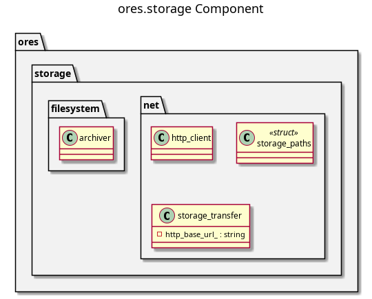

:PROPERTIES:
:ID: ED632650-BFB1-4904-BE34-CFA4B6170B8B
:END:
#+title: ores.storage
#+description: File storage abstractions — local filesystem paths and HTTP-based file transfer for binary assets.
#+type: ores.codegen.component
#+level: cross
#+filetags: :storage:filesystem:component:
#+created: 2026-05-20
#+updated: 2026-05-20
#+name: storage
#+full_name: ores.storage
#+brief: Generic object storage API for ORE Studio.

* Diagram

#+attr_html: :width 100% :alt ores.storage component diagram
#+caption: ores.storage

* Summary

=ores.storage= provides file storage abstractions for binary assets in ORE
Studio. It includes path resolution helpers (=storage_paths=), HTTP-based
file transfer (=http_client=, =storage_transfer=), and archive operations
(=archiver=) for packing and unpacking asset bundles. It is used by
=ores.assets= for image serving and data-transfer workflows.

* Inputs

- Local filesystem paths for asset files.
- HTTP endpoint URLs and credentials for remote file transfer.
- Archive paths and file lists for pack/unpack operations.

* Outputs

- Transferred files written to local storage or remote HTTP endpoints.
- Extracted asset bundles on the local filesystem.

* Entry points

- =include/ores.storage/filesystem/storage_paths.hpp= — path resolution.
- =include/ores.storage/net/http_client.hpp= — HTTP file client.
- =include/ores.storage/net/storage_transfer.hpp= — upload/download logic.
- =include/ores.storage/filesystem/archiver.hpp= — archive pack/unpack.

* Dependencies

- Boost.Beast or libcurl — HTTP transfer.
- =ores.platform= — filesystem utilities.

* See also

-
