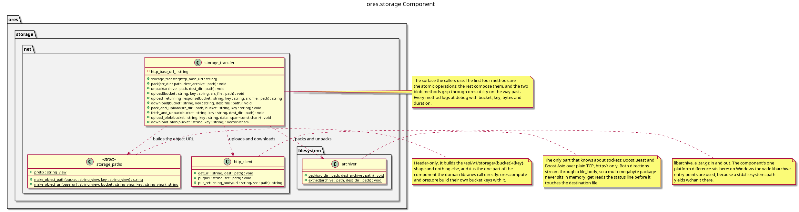

:PROPERTIES:
:ID: ED632650-BFB1-4904-BE34-CFA4B6170B8B
:END:
#+title: ores.storage
#+name: storage
#+full_name: ores.storage
#+description: The generic object storage client: bucket and key path helpers, an HTTP file client, a tar.gz archiver, and the composite transfer helpers the domain components share.
#+type: ores.codegen.component
#+level: cross
#+filetags: :storage:filesystem:component:
#+created: 2026-05-20
#+updated: 2026-09-26
#+brief: Generic object storage API for ORE Studio.

* Diagram

#+attr_html: :width 100% :alt ores.storage component diagram
#+caption: ores.storage

* Summary

=ores.storage= is the client half of ORE Studio's object storage. It moves
files between a local disk and an S3-shaped HTTP API that keeps objects
under a bucket and a key, and it holds no bucket names of its own: a caller
names its bucket, the way =ores.compute= names its package bucket and
=ores.ore= its import and report buckets.

Four types carry that work. =net/storage_paths= builds the
=/api/v1/storage/{bucket}/{key}= path and URL. =net/http_client= is the
synchronous HTTP/1.1 GET and PUT over Boost.Beast, streaming file bodies
rather than buffering them, and it is the only piece that knows about
sockets. =filesystem/archiver= packs and extracts =tar.gz= trees through
libarchive. =net/storage_transfer= composes the three into the atomic
=pack=, =unpack=, =upload= and =download= operations, plus the composite
=pack_and_upload=, =fetch_and_unpack=, =upload_blob= and =download_blob=
helpers that every caller actually uses.

The component is model-free. It owns no entity, no junction, no NATS
subject and no protocol header, so none of its types is generated and none
appears on the wire; its wire contract is the HTTP path shape above, which
it documents rather than declares. Everything it exposes is hand-written.

Every operation is synchronous and blocking, and the callers run them on
background threads. The composite helpers stage through a temporary file
under the system temporary directory.

* Facets

- =filesystem/= — =archiver=, the libarchive =pack= and =extract= pair for
  =tar.gz= trees, including the platform difference in how libarchive is
  handed a path.
- =net/= — =storage_paths= for the bucket and key path and URL,
  =http_client= for the GET and PUT primitive, and =storage_transfer= for
  the atomic and composite operations built on the two.

* Inputs

- A local directory or file to pack, upload or download.
- A storage endpoint: the HTTP base URL, a bucket name and an object key.
- A =tar.gz= archive to extract.
- An in-memory blob to upload, and the compressed bytes to decode on the
  way back.

* Outputs

- Files written to a local path, or objects written to the remote bucket.
- Extracted directory trees.
- The server's response body, for the uploads that read a server-computed
  checksum out of it.
- Decompressed blobs in memory.

* Entry points

- =include/ores.storage/ores.storage.hpp= — the namespace =@brief= doxygen
  renders, and the description the diagram conventions read.
- =include/ores.storage/net/storage_transfer.hpp= — the composite helpers
  the callers use.
- =include/ores.storage/net/storage_paths.hpp= — bucket and key to path and
  URL.
- =include/ores.storage/net/http_client.hpp= — the GET and PUT primitive.
- =include/ores.storage/filesystem/archiver.hpp= — =tar.gz= pack and
  extract.

* Dependencies

- =ores.utility= — gzip, for the in-memory blob transfers.
- =ores.platform= — the scoped temporary file the composite helpers stage
  through.
- LibArchive — the =tar.gz= pack and extract.
- Boost.Beast and Boost.Asio — the HTTP client.

=ores.logging= is linked but is the ubiquitous logging dependency every
component carries.

* See also

- [[id:1805BAFC-7E43-4D9C-822F-17C3455C6E00][Compute job lifecycle]] -- the bucket and key scheme the compute callers read and write, and the flow the package upload serves.
- [[id:A8B7F2C9-D416-4E83-B527-9F814E62C1A5][ores.compute]] -- a consumer: the package publisher and the compute storage helper.
- [[id:5F280C8C-8C50-40A2-8C84-C85B8821D33E][ores.ore]] -- a consumer: the import saga's execute handler and the report package handler.
- [[id:B079DA67-8408-4BD0-A93C-D108AC780872][Facet]] -- the catalogue that fixes the facet folder names above.
- [[id:B9D3D469-9E59-465F-8C18-34546B680D13][Component Documentation Guide]] -- what fills this overview well.
- [[id:271F40DA-D0EA-4D08-A4F8-3D2B835DF5E7][PlantUML class diagram conventions]] -- the rules the component diagram follows.
- [[id:FB797194-EB03-4837-B12D-E651DD5F16F2][Unit test conventions]] -- the Catch2 conventions the component's tests follow.
- [[id:0FB2EA84-EBB8-45C8-A8C8-F5815431C2D2][Code Review Checklist]] -- the naming and component-only checks this component passes.
- [[id:45CAC01F-BC56-4600-B206-EEE7545AE3AB][Component Architecture Audit]] -- the structural checklist and the platform-placement rule the archiver currently breaks.
- [[id:7B477025-132E-4B20-80B4-D8C9420880B8][Component Clean Standard]] -- the checklist this component was worked through.
